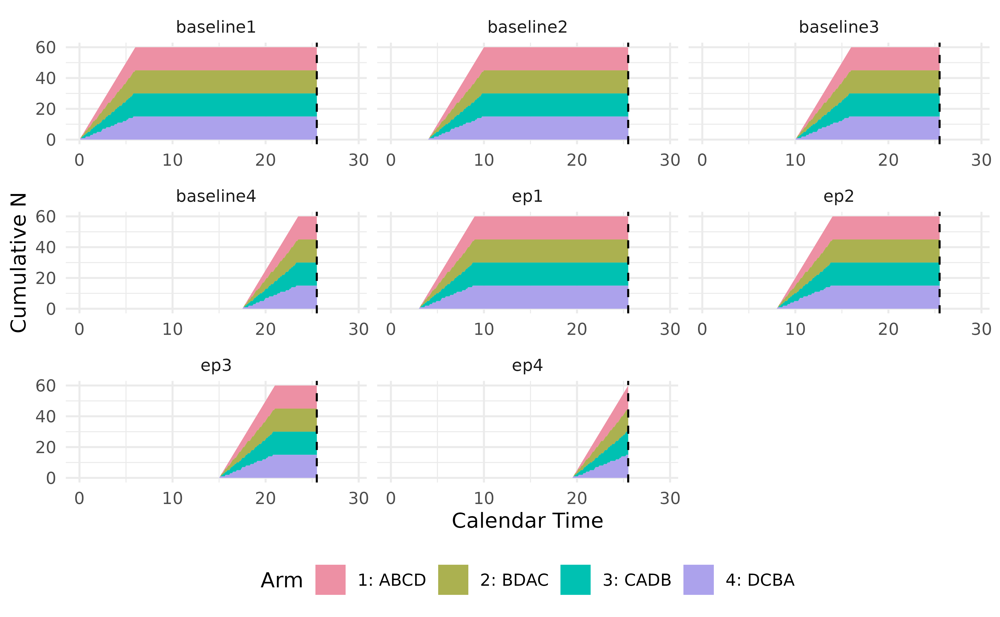

# Crossover Design with Wash-out Periods

The `TrialSimulator` package can handle three types of crossover design.
This vignette focuses on a trial for studies on symptom reduction, e.g.,
for chronic conditions with short-lived and reversible treatment
effects. A crossover trial is a longitudinal design where participants
receive multiple treatments sequentially, acting as their own control if
the carry-over effect can be minimized by the use of untreated wash-out
period. We can use the similar idea in the [vignette of longitudinal
endpoints](https://zhangh12.github.io/TrialSimulator/articles/defineLongitudinalEndpoints.html)
to implement simulation, where endpoints at the end of each treatment in
the pre-determined and randomized sequence are defined in function
[`endpoint()`](https://zhangh12.github.io/TrialSimulator/reference/endpoint.md)
with its argument `readout` is set.

To simulate dynamic treatment switching, please refer to its
[vignette](https://zhangh12.github.io/TrialSimulator/articles/dynamicTreatmentSwitching.html).

## Simulation Settings

In simulation, we assume a balanced Latin square design of four arms

| Sequence | Treatment 1 | Treatment 2 | Treatment 3 | Treatment 4 |
|----------|-------------|-------------|-------------|-------------|
| ABCD     | A           | B           | C           | D           |
| BDAC     | B           | D           | A           | C           |
| CADB     | C           | A           | D           | B           |
| DCBA     | D           | C           | B           | A           |

- duration of wash-out periods between treatments are 1, 2, 2.5 months,
  respectively.
- duration of treatments in sequence are 3, 4, 5, 2 months,
  respectively.

The figure shows the timeline of the trial


Additional settings are

- enroll 10 patients per week for 6 weeks. In total 60 patients are
  randomized into four arms evenly.
- no dropout.
- analyze the data when planned treatment for all patients are
  completed, i.e., approximately 25.5 weeks.
- statistical analysis is not implemented in this example.

## Define Endpoints in Four Arms

We collect baselines at the beginning of a new treatment (i.e., at the
end of wash-out period), and endpoint value when the treatment is
completed. To do so, we define four baseline variables and four endpoint
variables as below

``` r

all_endpoint_name <- c('baseline1', 'ep1', 
                       'baseline2', 'ep2', 
                       'baseline3', 'ep3', 
                       'baseline4', 'ep4')

readouts <- c(baseline1 = 0, ep1 = 3, 
              baseline2 = 4, ep2 = 8, 
              baseline3 = 10, ep3 = 15, 
              baseline4 = 17.5, ep4 = 19.5)

eps <- endpoint(
  name = all_endpoint_name,
  type = rep('non-tte', 8), 
  readout = readouts, 
  generator = rng, means = rep(c(0, .5), 4)
)

arm1 <- arm(name = 'ABCD')
arm1$add_endpoints(eps)
arm1
```

CjwhRE9DVFlQRSBodG1sPgo8aHRtbD4KPGhlYWQ+CiAgICA8bWV0YSBjaGFyc2V0PSJVVEYtOCI+CiAgICA8dGl0bGU+QXJtIE5hbWU6IEFCQ0Q8L3RpdGxlPgogICAgPHN0eWxlPgogICAgICAgIGJvZHkgewogICAgICAgICAgICBmb250LWZhbWlseTogQXJpYWwsIHNhbnMtc2VyaWY7CiAgICAgICAgICAgIG1hcmdpbjogMjBweDsKICAgICAgICAgICAgYmFja2dyb3VuZC1jb2xvcjogd2hpdGU7CiAgICAgICAgICAgIGRpc3BsYXk6IGZsZXg7CiAgICAgICAgICAgIGZsZXgtZGlyZWN0aW9uOiBjb2x1bW47CiAgICAgICAgICAgIGFsaWduLWl0ZW1zOiBjZW50ZXI7CiAgICAgICAgfQogICAgICAgIGgxIHsKICAgICAgICAgICAgY29sb3I6IGJsYWNrOwogICAgICAgICAgICB0ZXh0LWFsaWduOiBjZW50ZXI7CiAgICAgICAgICAgIG1hcmdpbi1ib3R0b206IDIwcHg7CiAgICAgICAgICAgIGZvbnQtc2l6ZTogMjBweDsKICAgICAgICB9CiAgICAgICAgLnN1YnRpdGxlIHsKICAgICAgICAgICAgdGV4dC1hbGlnbjogY2VudGVyOwogICAgICAgICAgICBjb2xvcjogIzY2NjsKICAgICAgICAgICAgbWFyZ2luLWJvdHRvbTogMjBweDsKICAgICAgICAgICAgZm9udC1zaXplOiAxNnB4OwogICAgICAgIH0KICAgICAgICB0YWJsZSB7CiAgICAgICAgICAgIGJvcmRlci1jb2xsYXBzZTogY29sbGFwc2U7CiAgICAgICAgICAgIGZvbnQtc2l6ZTogMTRweDsKICAgICAgICAgICAgYm9yZGVyOiAxcHggc29saWQgIzk5OTsKICAgICAgICAgICAgd2lkdGg6IGF1dG87CiAgICAgICAgICAgIG1hcmdpbjogMCBhdXRvOwogICAgICAgIH0KICAgICAgICB0aCB7CiAgICAgICAgICAgIGJhY2tncm91bmQtY29sb3I6ICNmMGYwZjA7CiAgICAgICAgICAgIGNvbG9yOiBibGFjazsKICAgICAgICAgICAgcGFkZGluZzogMTBweDsKICAgICAgICAgICAgdGV4dC1hbGlnbjogbGVmdDsKICAgICAgICAgICAgZm9udC13ZWlnaHQ6IG5vcm1hbDsKICAgICAgICAgICAgYm9yZGVyOiAxcHggc29saWQgIzk5OTsKICAgICAgICAgICAgd2hpdGUtc3BhY2U6IG5vd3JhcDsKICAgICAgICAgICAgZm9udC1zaXplOiAxNHB4OwogICAgICAgIH0KICAgICAgICB0ZCB7CiAgICAgICAgICAgIHBhZGRpbmc6IDEwcHg7CiAgICAgICAgICAgIGJvcmRlcjogMXB4IHNvbGlkICM5OTk7CiAgICAgICAgICAgIHZlcnRpY2FsLWFsaWduOiB0b3A7CiAgICAgICAgICAgIGxpbmUtaGVpZ2h0OiAxLjQ7CiAgICAgICAgICAgIGZvbnQtc2l6ZTogMTRweDsKICAgICAgICB9CiAgICAgICAgLm5vLWNvbCB7CiAgICAgICAgICAgIHRleHQtYWxpZ246IGNlbnRlcjsKICAgICAgICAgICAgd2hpdGUtc3BhY2U6IG5vd3JhcDsKICAgICAgICB9CiAgICAgICAgLnZhcmlhYmxlLWNvbCB7CiAgICAgICAgICAgIHdoaXRlLXNwYWNlOiBub3dyYXA7CiAgICAgICAgfQogICAgICAgIC5zdGF0cy1jb2wgewogICAgICAgIH0KICAgICAgICAuZnJlcXMtY29sIHsKICAgICAgICAgICAgbGluZS1oZWlnaHQ6IDIwcHg7CiAgICAgICAgfQogICAgICAgIC5ncmFwaC1jb2wgewogICAgICAgICAgICB0ZXh0LWFsaWduOiBjZW50ZXI7CiAgICAgICAgICAgIHdoaXRlLXNwYWNlOiBub3dyYXA7CiAgICAgICAgICAgIHZlcnRpY2FsLWFsaWduOiB0b3A7CiAgICAgICAgfQogICAgICAgIGltZyB7CiAgICAgICAgICAgIGRpc3BsYXk6IGJsb2NrOwogICAgICAgICAgICBtYXJnaW46IDAgYXV0bzsKICAgICAgICAgICAgdmVydGljYWwtYWxpZ246IHRvcDsKICAgICAgICB9CiAgICA8L3N0eWxlPgo8L2hlYWQ+Cjxib2R5PgogICAgPGgxPkFybSBOYW1lOiBBQkNEPC9oMT4KICAgIDxkaXYgY2xhc3M9InN1YnRpdGxlIiBzdHlsZT0idGV4dC1hbGlnbjogbGVmdDsiPgogICAgICAgIEVuZHBvaW50cyAoOCk6YmFzZWxpbmUxLCBlcDEsIGJhc2VsaW5lMiwgZXAyLCBiYXNlbGluZTMsIGVwMywgYmFzZWxpbmU0LCBlcDQ8YnI+CiAgICA8L2Rpdj4KCiAgICA8dGFibGU+CiAgICAgICAgPHRoZWFkPgogICAgICAgICAgICA8dHI+CiAgICAgICAgICAgICAgICA8dGggY2xhc3M9Im5vLWNvbCI+Tm88L3RoPgogICAgICAgICAgICAgICAgPHRoIGNsYXNzPSJ2YXJpYWJsZS1jb2wiPlZhcmlhYmxlPC90aD4KICAgICAgICAgICAgICAgIDx0aCBjbGFzcz0ic3RhdHMtY29sIj5TdGF0cyAvIEZyZXFzPC90aD4KICAgICAgICAgICAgICAgIDx0aCBjbGFzcz0iZ3JhcGgtY29sIj5HcmFwaDwvdGg+CiAgICAgICAgICAgIDwvdHI+CiAgICAgICAgPC90aGVhZD4KICAgICAgICA8dGJvZHk+CiAgICAgICAgICAgIDx0cj4KICAgICAgICAgICAgICAgIDx0ZCBjbGFzcz0ibm8tY29sIj4xPC90ZD4KICAgICAgICAgICAgICAgIDx0ZCBjbGFzcz0idmFyaWFibGUtY29sIj5iYXNlbGluZTE8YnI+W251bWVyaWNdPC90ZD4KICAgICAgICAgICAgICAgIDx0ZCBjbGFzcz0ic3RhdHMtY29sIj5NZWFuIChzZCk6IC0wLjAxICgxKTxicj5NaW4gPCBtZWRpYW4gPCBtYXg6PGJyPi00LjI3IDwgLTAuMDIgPCAzLjM5PGJyPklRUiAoQ1YpOiAxLjM0ICgxMDApPGJyPk1pc3Npbmc6IDAgKDAlKTwvdGQ+CiAgICAgICAgICAgICAgICA8dGQgY2xhc3M9ImdyYXBoLWNvbCI+PGltZyBzcmM9ImRhdGE6aW1hZ2UvcG5nO2Jhc2U2NCxpVkJPUncwS0dnb0FBQUFOU1VoRVVnQUFBSGdBQUFCUUNBTUFBQURsUlVHN0FBQUFsbEJNVkVXWm1abWFtcHFjbkp5ZG5aMmZuNStnb0tDaG9hR2pvNk9rcEtTbHBhV21wcWFvcUtpcHFhbXJxNnVzckt5dHJhMnVycTZ4c2JHeXNySzB0TFMydHJhM3Q3ZTR1TGk2dXJxN3U3dTh2THkrdnI2L3Y3L0N3c0xEdzhQRXhNVEp5Y25OemMzUHo4L1EwTkRSMGRIUzB0TFQwOVBhMnRyYjI5dmQzZDNoNGVIajQrUGs1T1R2NysveDhmSDYrdnI5L2YzKy92Ny8vLzlqVy9NSUFBQUFDWEJJV1hNQUFBN0RBQUFPd3dISGI2aGtBQUFBK1VsRVFWUm9nZTNheXc2Q01CQUYwSXFDaWlJK2VTZ0tQa0JSa2ZyL1ArZkdNSk1vTVNSU05MbDNOVWtuYzVxdXVoaHhieWppditBMFpFa1Z3cDd0RkxHRzdCSzd1dUZWWEdUYXBVczRyVndoYkZNZEF3WU1HREJnd0lBQkF3WU1HREJnd0lBQkF3WU0rTGRncVFtV1V2aDhvZHkrQXVjdE5sOHZnOFdBMGptcWhBOVVqeFBBZ0FFREJnd1lNR0RBZ0Y4ak04cFZKWHpTakNKNlpYZ1Vzczk5VmdsT3hqUm1YeGsydXZTNTd6a0tZWDFKZGJENExUamVVbWFXWGNUczA0YkhYTEIxanpaYlFESDVIb2hZdkcreU9qVFZudVJQV0Vac2Q4WGRVQjM0N0dET2FvODFyYjJTSmorZ2V1T3lnMGgrZXVvNjB4ajhBSjhLYTR0c01JdU5BQUFBQUVsRlRrU3VRbUNDIiBhbHQ9Imhpc3RvZ3JhbSI+PC90ZD4KICAgICAgICAgICAgPC90cj4KICAgICAgICAgICAgPHRyPgogICAgICAgICAgICAgICAgPHRkIGNsYXNzPSJuby1jb2wiPjI8L3RkPgogICAgICAgICAgICAgICAgPHRkIGNsYXNzPSJ2YXJpYWJsZS1jb2wiPmVwMTxicj5bbnVtZXJpY108L3RkPgogICAgICAgICAgICAgICAgPHRkIGNsYXNzPSJzdGF0cy1jb2wiPk1lYW4gKHNkKTogMC41MSAoMSk8YnI+TWluIDwgbWVkaWFuIDwgbWF4Ojxicj4tMy45MiA8IDAuNTEgPCA0LjE2PGJyPklRUiAoQ1YpOiAxLjMzICgxLjk2KTxicj5NaXNzaW5nOiAwICgwJSk8L3RkPgogICAgICAgICAgICAgICAgPHRkIGNsYXNzPSJncmFwaC1jb2wiPjxpbWcgc3JjPSJkYXRhOmltYWdlL3BuZztiYXNlNjQsaVZCT1J3MEtHZ29BQUFBTlNVaEVVZ0FBQUhnQUFBQlFDQU1BQUFEbFJVRzdBQUFBa0ZCTVZFV1ptWm1hbXBxYm01dWNuSnlkbloyZ29LQ2hvYUdqbzZPbHBhV21wcWFucDZlb3FLaXFxcXF0cmEydXJxNnlzckswdExTMXRiVzJ0cmEzdDdlNHVMaTZ1cnE3dTd1OHZMeS92Ny9Dd3NMRHc4UEV4TVRJeU1qSnljbk16TXpOemMzUHo4L1IwZEhTMHRMVDA5UGEydHJjM056ZjM5L2c0T0RoNGVIazVPVHA2ZW52NysveDhmSDkvZjMrL3Y3Ly8vOHdZWEFTQUFBQUNYQklXWE1BQUE3REFBQU93d0hIYjZoa0FBQUE3MGxFUVZSb2dlM2F5UTZDTUJTRjRTSW9JaUtLV0p3bm5BZDgvN2R6MTNzV1R0RllOWjUvZGNOdCtFamNtYXJUaDFLL0JXOUcwTVlpcktQVUZHbWJjRGMzZFFrVEpreVlNR0hDaEFrVEp2ejk4RzRyeFJiaG94TktKWURibFVocXZRTVdLeThESElkRFNSMHR3aEVzSE1LRUNSTW1USmd3WWNLRUNSTW1USmh3N3V3UDBzMlB1QW12RmZRUXJNb1ZrN3Q4R2w0MDVKV3p4K0M1ekkwRlljS0Uvd3hld2RXUzlDVTRxRGVsL0JKY2pBR3J1WjdKcWNvOWswVEpuSHB3QVNYd1lhSGFjTWlYdjN2OUVJaXBnU2Z3dERPUXVaZkJJb0ZadzZHK3ZuSW82OGs4Nk1CaVV0ejdqZC9aeCtBejEvSXcwUlVIVXRNQUFBQUFTVVZPUks1Q1lJST0iIGFsdD0iaGlzdG9ncmFtIj48L3RkPgogICAgICAgICAgICA8L3RyPgogICAgICAgICAgICA8dHI+CiAgICAgICAgICAgICAgICA8dGQgY2xhc3M9Im5vLWNvbCI+MzwvdGQ+CiAgICAgICAgICAgICAgICA8dGQgY2xhc3M9InZhcmlhYmxlLWNvbCI+YmFzZWxpbmUyPGJyPltudW1lcmljXTwvdGQ+CiAgICAgICAgICAgICAgICA8dGQgY2xhc3M9InN0YXRzLWNvbCI+TWVhbiAoc2QpOiAwLjAxICgxKTxicj5NaW4gPCBtZWRpYW4gPCBtYXg6PGJyPi00LjA2IDwgMCA8IDMuOTxicj5JUVIgKENWKTogMS4zNSAoMTAwKTxicj5NaXNzaW5nOiAwICgwJSk8L3RkPgogICAgICAgICAgICAgICAgPHRkIGNsYXNzPSJncmFwaC1jb2wiPjxpbWcgc3JjPSJkYXRhOmltYWdlL3BuZztiYXNlNjQsaVZCT1J3MEtHZ29BQUFBTlNVaEVVZ0FBQUhnQUFBQlFDQU1BQUFEbFJVRzdBQUFBbkZCTVZFV1ptWm1hbXBxYm01dWNuSnlkbloyZW5wNmZuNStnb0tDaG9hR2lvcUtqbzZPbHBhV21wcWFycTZ1c3JLeXRyYTJ1cnE2d3NMQ3lzckt6czdPMHRMUzJ0cmEzdDdlNHVMaTV1Ym02dXJxN3U3dTh2THkrdnI2L3Y3L0N3c0xEdzhQRXhNVEp5Y25OemMzUHo4L1IwZEhTMHRMVDA5UFcxdGJhMnRyYjI5dmQzZDNoNGVIazVPVHY3Ky94OGZIejgvUDUrZm45L2YzKy92Ny8vLytUNElHSUFBQUFDWEJJV1hNQUFBN0RBQUFPd3dISGI2aGtBQUFBK1VsRVFWUm9nZTNheVE2Q01CU0Y0ZUtFQTFwbkJCUnh3Z0VuOFAzZnpjU1kzcnVRR0JJc1VjKy91a21iZmtsWFhWVGNDa3A4Rnh3dFdKRkcySlcyU3JvNjRWbW84dVNXMm11RUIyYVBNbUo5Y0YvU0hBSUdEQmd3WU1DQUFRTUdEQmd3WU1DQUFRTUcvQlB3NmF5NkpCcGhZZFpWNVVNKzhQRkE5VkxoRGMzZFhTNXdiSFNva2xhWW5XOENCZ3dZTUdEQWdBRUQvbk5ZcnVseGY3NW1naVBCeWd3M3F2UzRyMDB5d2JzdUhiUE9ESnRUbXYweDRBY2NycWhCVzZxc0Z2MHpHUW1hN1FyN2dHSTEyWUlZdjk3VXJnOHBPMzdDeVpKOW9IRUNtbjJQTFl6WTdMSk5jemRsaytmVEhEaHNZWm04dStwUFZoaDhCOFZyckRuNEZYanhBQUFBQUVsRlRrU3VRbUNDIiBhbHQ9Imhpc3RvZ3JhbSI+PC90ZD4KICAgICAgICAgICAgPC90cj4KICAgICAgICAgICAgPHRyPgogICAgICAgICAgICAgICAgPHRkIGNsYXNzPSJuby1jb2wiPjQ8L3RkPgogICAgICAgICAgICAgICAgPHRkIGNsYXNzPSJ2YXJpYWJsZS1jb2wiPmVwMjxicj5bbnVtZXJpY108L3RkPgogICAgICAgICAgICAgICAgPHRkIGNsYXNzPSJzdGF0cy1jb2wiPk1lYW4gKHNkKTogMC40OSAoMSk8YnI+TWluIDwgbWVkaWFuIDwgbWF4Ojxicj4tMy4zIDwgMC40OCA8IDQuMzxicj5JUVIgKENWKTogMS4zNSAoMi4wNCk8YnI+TWlzc2luZzogMCAoMCUpPC90ZD4KICAgICAgICAgICAgICAgIDx0ZCBjbGFzcz0iZ3JhcGgtY29sIj48aW1nIHNyYz0iZGF0YTppbWFnZS9wbmc7YmFzZTY0LGlWQk9SdzBLR2dvQUFBQU5TVWhFVWdBQUFIZ0FBQUJRQ0FNQUFBRGxSVUc3QUFBQW1WQk1WRVdabVptYW1wcWJtNXVjbkp5ZG5aMmdvS0Nob2FHam82T2twS1NscGFXbXBxYW9xS2lwcWFtc3JLeXRyYTJ1cnE2dnI2K3dzTEN5c3JLenM3TzJ0cmEzdDdlNHVMaTZ1cnE3dTd1OHZMeS92Ny9Dd3NMRHc4UEV4TVRKeWNuTnpjM1B6OC9SMGRIUzB0TFQwOVBVMU5UVzF0YmEydHJiMjl2YzNOemQzZDNoNGVIaTR1THY3Ky94OGZIMjl2YjQrUGo5L2YzKy92Ny8vLy8yc0dHaUFBQUFDWEJJV1hNQUFBN0RBQUFPd3dISGI2aGtBQUFBOGtsRVFWUm9nZTNheVE2Q1FCQkYwVWJBQWJVUkIyaEFSY1Y1UlAvLzQ5eFJ0VUFrR25GNmQxVkpkVGdrSkt4YVhONlUrQzU0TzJadFM0U1ZkTk9rS2hNTzRyUUFNR0RBZ0FFREJnd1lNR0RBbncvdk5wUlRJcHhvYmFyQ1lGOHVxTlVyWUxKaWs4RTkwNkcwcER5NEs5a0NNR0RBZ0FFREJnd1lNR0RBZ0FFRC9rSDRSQjJMd2ZzRGxmc1N1ZkJHTTZoQ3NEQ3JhZnI2WVhocDB5T254ZUFaemZZU01HREFmd2J6dXlYdVU3RFZVZFE4Q3o1SERHdnE3Qy9ab0hzbWZVR3phN0FMS0ZhTkxjU0FIVExyYWRYV2hJb3pZVzlFYytpelJaL05paDBhcWh1SC9KRG1rY2NXMGZuZU4zNWxiNE92dlFDR1AzSCt2MThBQUFBQVNVVk9SSzVDWUlJPSIgYWx0PSJoaXN0b2dyYW0iPjwvdGQ+CiAgICAgICAgICAgIDwvdHI+CiAgICAgICAgICAgIDx0cj4KICAgICAgICAgICAgICAgIDx0ZCBjbGFzcz0ibm8tY29sIj41PC90ZD4KICAgICAgICAgICAgICAgIDx0ZCBjbGFzcz0idmFyaWFibGUtY29sIj5iYXNlbGluZTM8YnI+W251bWVyaWNdPC90ZD4KICAgICAgICAgICAgICAgIDx0ZCBjbGFzcz0ic3RhdHMtY29sIj5NZWFuIChzZCk6IDAgKDEpPGJyPk1pbiA8IG1lZGlhbiA8IG1heDo8YnI+LTMuODEgPCAtMC4wMSA8IDMuNjc8YnI+SVFSIChDVik6IDEuMzUgKEluZik8YnI+TWlzc2luZzogMCAoMCUpPC90ZD4KICAgICAgICAgICAgICAgIDx0ZCBjbGFzcz0iZ3JhcGgtY29sIj48aW1nIHNyYz0iZGF0YTppbWFnZS9wbmc7YmFzZTY0LGlWQk9SdzBLR2dvQUFBQU5TVWhFVWdBQUFIZ0FBQUJRQ0FNQUFBRGxSVUc3QUFBQXExQk1WRVdhbXBxYm01dWNuSnlkbloyZW5wNmZuNStob2FHaW9xS2pvNk9scGFXbnA2ZW9xS2lwcWFtcXFxcXNyS3l1cnE2dnI2K3dzTEN6czdPMXRiVzJ0cmEzdDdlNHVMaTV1Ym02dXJxN3U3dTh2THkrdnI2L3Y3L0J3Y0hDd3NMRHc4UEZ4Y1hIeDhmSnljbkx5OHZOemMzVDA5UFgxOWZZMk5qaTR1TGo0K1BrNU9UbDVlWG01dWJxNnVydTd1N3c4UER4OGZIejgvUDE5Zlg0K1BqNStmbjYrdnI5L2YzKy92Ny8vLzhoeHVkQ0FBQUFDWEJJV1hNQUFBN0RBQUFPd3dISGI2aGtBQUFBK1VsRVFWUm9nZTNhU3hPQlVBREY4VkNKOGlZa2xFY1I4aTdmLzVQWldKeG1UTk9Fd3B6LzdpeTZ2NW1XZDY1d3l5bmhOK0Q5TE5JdU05aXA2RkRWOUxEckorSFdFbEpsRlpMYzdPQXVycFpEbURCaHdvUUpFeVpNbURCaHdvUUpFeVpNbUREaGI0R0REVjVYMm5IdzhneGRYb1U5TVhKZkdRTXJoUklrYkYrRTF4b2Uzb2lCeXdhdTJvb3dZY0tFQ1JNbVRKZ3c0WGZEbW51QWprbmdrMXFGbEpTd0tNbVFzRThBKytVNTFFNEpsNmE0RkQ4SnJPQW4rbC9Dd1dnSWRVUjhaS0xKdUNxUkJ5aXlpa3VzNHlvMGNSVTdLSXlEQnh3dThCMk4zY05sOVhGTkRGeW1pY3VZNEJwWXVIbzJya1g0OUZkblZHN3dIVXN0Q2daQ2Q5dVJBQUFBQUVsRlRrU3VRbUNDIiBhbHQ9Imhpc3RvZ3JhbSI+PC90ZD4KICAgICAgICAgICAgPC90cj4KICAgICAgICAgICAgPHRyPgogICAgICAgICAgICAgICAgPHRkIGNsYXNzPSJuby1jb2wiPjY8L3RkPgogICAgICAgICAgICAgICAgPHRkIGNsYXNzPSJ2YXJpYWJsZS1jb2wiPmVwMzxicj5bbnVtZXJpY108L3RkPgogICAgICAgICAgICAgICAgPHRkIGNsYXNzPSJzdGF0cy1jb2wiPk1lYW4gKHNkKTogMC40OSAoMC45OSk8YnI+TWluIDwgbWVkaWFuIDwgbWF4Ojxicj4tMi45NiA8IDAuNDkgPCA0LjY8YnI+SVFSIChDVik6IDEuMzUgKDIuMDIpPGJyPk1pc3Npbmc6IDAgKDAlKTwvdGQ+CiAgICAgICAgICAgICAgICA8dGQgY2xhc3M9ImdyYXBoLWNvbCI+PGltZyBzcmM9ImRhdGE6aW1hZ2UvcG5nO2Jhc2U2NCxpVkJPUncwS0dnb0FBQUFOU1VoRVVnQUFBSGdBQUFCUUNBTUFBQURsUlVHN0FBQUFxMUJNVkVXYW1wcWJtNXVlbnA2Zm41K2dvS0Nob2FHaW9xS2pvNk9rcEtTbHBhV21wcWFvcUtpcHFhbXFxcXFzckt5dHJhMnVycTZ3c0xDeHNiR3pzN08wdExTMXRiVzJ0cmEzdDdlNHVMaTV1Ym02dXJxN3U3dTh2THkvdjcvQ3dzTEV4TVRGeGNYR3hzYkh4OGZKeWNuTXpNek56YzNQejgvVDA5UFgxOWZZMk5qZDNkM2k0dUxqNCtQazVPVGw1ZVhxNnVydTd1N3c4UEQyOXZiNCtQajUrZm43Ky92OS9mMysvdjcvLy8rQlh5MklBQUFBQ1hCSVdYTUFBQTdEQUFBT3d3SEhiNmhrQUFBQStFbEVRVlJvZ2UzYXlRcUNVQUNGWVZPdkRUYlpvRlpxWlpuTjgvVCtUOVlxT0JkY0tNU1Y0UHk3cy9GRGhMdFF0WGRKYWY4Qlh4WlNKMlh3dXU1RDlsSWQ3S1NRUzVnd1ljS0VDUk1tVEpqd2Y4R1BMUmFwZy9kR0d6SWxlQmdlb09QanQzQVRxYTRFMjhLR2pJMDYyTVhsckFrVEpreVlNR0hDaEFrVEpreVlNR0hDaEF2RE4yOEFkWExETFZmNnhIc3RESi9OS2VUa2hxMDJmdUlWdStKd0ZTL241NGNENmY0SkV5YXNGSDcyTzFEckozQzFONEhDZXlaODEvQ2RkRVBIRTZncGNOV2xIMUNFalV1WFRxNktWWU8wK1FwS3YvQXJ3VU0yOW5ETlJyaWlBRmNZNGdvaVhPTVpMaS9HbGJ3eW43R2lTb00va1BnMGxwa0pPVEFBQUFBQVNVVk9SSzVDWUlJPSIgYWx0PSJoaXN0b2dyYW0iPjwvdGQ+CiAgICAgICAgICAgIDwvdHI+CiAgICAgICAgICAgIDx0cj4KICAgICAgICAgICAgICAgIDx0ZCBjbGFzcz0ibm8tY29sIj43PC90ZD4KICAgICAgICAgICAgICAgIDx0ZCBjbGFzcz0idmFyaWFibGUtY29sIj5iYXNlbGluZTQ8YnI+W251bWVyaWNdPC90ZD4KICAgICAgICAgICAgICAgIDx0ZCBjbGFzcz0ic3RhdHMtY29sIj5NZWFuIChzZCk6IC0wLjAxICgxKTxicj5NaW4gPCBtZWRpYW4gPCBtYXg6PGJyPi0zLjYgPCAtMC4wMSA8IDMuNDQ8YnI+SVFSIChDVik6IDEuMzYgKDEwMCk8YnI+TWlzc2luZzogMCAoMCUpPC90ZD4KICAgICAgICAgICAgICAgIDx0ZCBjbGFzcz0iZ3JhcGgtY29sIj48aW1nIHNyYz0iZGF0YTppbWFnZS9wbmc7YmFzZTY0LGlWQk9SdzBLR2dvQUFBQU5TVWhFVWdBQUFIZ0FBQUJRQ0FNQUFBRGxSVUc3QUFBQXJsQk1WRVdabVptYm01dWNuSnlkbloyZW5wNmZuNStnb0tDaG9hR2lvcUtqbzZPa3BLU2xwYVdtcHFhbnA2ZW9xS2lwcWFtcXFxcXNyS3l1cnE2dnI2K3dzTEN6czdPMHRMUzF0YlcydHJhM3Q3ZTR1TGk1dWJtNnVycTd1N3U4dkx5OXZiMit2cjYvdjcvQndjSEN3c0xEdzhQRnhjWEd4c2JIeDhmSnljbkx5OHZOemMzUHo4L1QwOVBXMXRiWDE5Zmk0dUxqNCtQbzZPanE2dXJ1N3U3dzhQRHo4L1AxOWZYNit2cisvdjcvLy85TWxtZDZBQUFBQ1hCSVdYTUFBQTdEQUFBT3d3SEhiNmhrQUFBQTdVbEVRVlJvZ2UzYXh3NkNRQlNGWWF3d0ltUERybGl3b21MQmd1Ly9ZcTVNRGk2STBUaGdjdjdkMmN3M0QzQzFlMEpwL3dHZlY1Rk95bURmN0VIbDFnYTcvQksydDVCbHRTRGhLNE5sQjVkTm1EQmh3b1FKRXlaTW1EQmh3b1FKRXlaTW1ERGgxMjcrRGhxcmd3OEZHekppNEpJVzZmZ3RYTUhINnpHdzRlQ3E3Z2tUSmt5WU1HSENoQWtUVGdGOGxSWWsxTUdCc1lhYUg4SkZnZCtYMTNkZ2dRLzBQb1J6SS95K0VhaURaN2hFeXVCd09vVGFlVHd5cWVpNHpNZ0JpaTV4NVd1NE1nMWMyYUVMTGNJbjdPRWR6YktMYTk3SDVUcTRKaE5jam90ck1NZlZYZUx5bm5BaUpRWS9BSDcvY28rMGtURnZBQUFBQUVsRlRrU3VRbUNDIiBhbHQ9Imhpc3RvZ3JhbSI+PC90ZD4KICAgICAgICAgICAgPC90cj4KICAgICAgICAgICAgPHRyPgogICAgICAgICAgICAgICAgPHRkIGNsYXNzPSJuby1jb2wiPjg8L3RkPgogICAgICAgICAgICAgICAgPHRkIGNsYXNzPSJ2YXJpYWJsZS1jb2wiPmVwNDxicj5bbnVtZXJpY108L3RkPgogICAgICAgICAgICAgICAgPHRkIGNsYXNzPSJzdGF0cy1jb2wiPk1lYW4gKHNkKTogMC41ICgwLjk5KTxicj5NaW4gPCBtZWRpYW4gPCBtYXg6PGJyPi0zLjEyIDwgMC41MSA8IDQuMzxicj5JUVIgKENWKTogMS4zNSAoMS45OCk8YnI+TWlzc2luZzogMCAoMCUpPC90ZD4KICAgICAgICAgICAgICAgIDx0ZCBjbGFzcz0iZ3JhcGgtY29sIj48aW1nIHNyYz0iZGF0YTppbWFnZS9wbmc7YmFzZTY0LGlWQk9SdzBLR2dvQUFBQU5TVWhFVWdBQUFIZ0FBQUJRQ0FNQUFBRGxSVUc3QUFBQWtGQk1WRVdabVptYW1wcWJtNXVjbkp5ZG5aMmVucDZmbjUrZ29LQ2hvYUdqbzZPa3BLU2xwYVdtcHFhbnA2ZW9xS2lwcWFtcnE2dXRyYTJ1cnE2dnI2K3lzcksydHJhM3Q3ZTR1TGk2dXJxN3U3dTh2THkrdnI2L3Y3L0F3TURDd3NMRHc4UEV4TVRKeWNuTHk4dk56YzNQejgvUjBkSFMwdExUMDlQWDE5ZmEydHJoNGVIbDVlWHM3T3o5L2YzKy92Ny8vLyt2Vno3NUFBQUFDWEJJV1hNQUFBN0RBQUFPd3dISGI2aGtBQUFBK2tsRVFWUm9nZTNhV3d1Q1FCQUY0RFc3V21iYVJkZnVWOHZLL3YrL0M0SjJ6a3NsbFVsd3p0UGdMUHNKZ2cvRHFFdEpVZjhGcDB0SStrTlkrNkdKcjM4SlR4S1RDV0hDaEFrVEpreVlNR0hDaFA4WEh0VmNTZi83Y09ZMEpEYkFBMjhsVWVldncyZHJJNmtqN0V1ZFdFWEFjSCtETUdIQ2hBa1RKa3lZTUdIQ2hBa1RKbHc0Zk5LU0tCOE04eEQzK0RaOGNLY200MXl3Z25sSTcvQStITWlWMjN6d1R1cUFNR0hDSmNGNytGdjFQNEs3NGJNdGxSdWN3SHpVYXpvbXRiYnNtUXlWMUdFVkZsQTZMV2lvRVJ5cVZFM3NMcnpFNWc1bmEzZ2FMYVNleGRBWVFxM2gwRncvT0JUUHBGNUUwRmhucjc1eGtTa052Z0wrdEZoQW1DSU9KUUFBQUFCSlJVNUVya0pnZ2c9PSIgYWx0PSJoaXN0b2dyYW0iPjwvdGQ+CiAgICAgICAgICAgIDwvdHI+CiAgICAgICAgPC90Ym9keT4KICAgIDwvdGFibGU+CjwvYm9keT4KPC9odG1sPgo=

Here, a custom random number generator, `rng`, is provided by users to
describe how data of the treatment sequence `ABCD` is generated. For the
purpose of illustration, we simply assume an independent structure
between baselines and endpoints (`vcov = diag(1, 8)`). Users can adopt
much complex models to simulate carry-over effect or other mechanism.
Note that `rng` uses its default value for `vcov`, and a custom value
for its argument `means`. We will use different value for `means` when
defining other arms.

``` r

rng <- function(n, means, vcov = diag(1, 8)){
  ret <- as.data.frame(rmvnorm(n, mean = means, sigma = vcov))
  colnames(ret) <- c('baseline1', 'ep1', 
                     'baseline2', 'ep2', 
                     'baseline3', 'ep3', 
                     'baseline4', 'ep4')
  ret
}
```

Adopting `TrialSimulator` in development of simulation enjoys the
convenience of writing similar codes with good readability. To see that,
here is how we define the other three arms

``` r

eps <- endpoint(
  name = all_endpoint_name,
  type = rep('non-tte', 8), 
  readout = readouts, 
  generator = rng, means = rep(c(0, .6), 4) # diff means
)

arm2 <- arm(name = 'BDAC')
arm2$add_endpoints(eps)

eps <- endpoint(
  name = all_endpoint_name,
  type = rep('non-tte', 8), 
  readout = readouts, 
  generator = rng, means = rep(c(0, .2), 4), vcov = diag(1.2, 8) # diff means/vcov
)

arm3 <- arm(name = 'CADB')
arm3$add_endpoints(eps)

eps <- endpoint(
  name = all_endpoint_name,
  type = rep('non-tte', 8), 
  readout = readouts, 
  generator = rng, means = rep(c(0, 0), 4) # diff means
)

arm4 <- arm(name = 'DCBA')
arm4$add_endpoints(eps)
```

## Define a Trial

As planned, we recruit 10 patients per week until 60 patients are
randomized. A built-in enroller function `StaggeredRecruiter` is used to
enroll patients. Note that the last patient would be randomized at the
6th week and complete all treatments at week 25.5. We can set
`duration = 25.5` in function
[`trial()`](https://zhangh12.github.io/TrialSimulator/reference/trial.md),
however, we set it to a greater number (28) so that we can illustrate
some nice features of `TrialSimulator` later.

``` r

accrual_rate <- data.frame(end_time = c(6, Inf),
                           piecewise_rate = c(10, 10))

trial <- trial(name = 'crossover-trial', 
               n_patients = 60, 
               duration = 28,
               enroller = StaggeredRecruiter, accrual_rate = accrual_rate, 
               silent = TRUE)

trial$add_arms(sample_ratio = c(1, 1, 1, 1), arm1, arm2, arm3, arm4)
trial
#>  ⚕⚕         Trial Name:  crossover-trial  
#>  ⚕⚕        Description:  crossover-trial  
#>  ⚕⚕     Number of Arms:  4  
#>  ⚕⚕    Registered Arms:  ABCD, BDAC, CADB, DCBA  
#>  ⚕⚕       Sample Ratio:  1, 1, 1, 1  
#>  ⚕⚕ Number of Patients:  60  
#>  ⚕⚕   Planned Duration:  28  
#>  ⚕⚕            Regimen:  not set  
#>  ⚕⚕        Random Seed:  973100785
```

## Define Milestone and Action

Next, we define the only milestone of the trial where data is analyzed.
In this example, we have three different ways to specify the triggering
condition of the milestone equivalently, using the three key functions
of the condition system.

The first one uses
[`calendarTime()`](https://zhangh12.github.io/TrialSimulator/reference/calendarTime.md)
where we set the 25.5th weeks as the end of trial. Note that the
simulate will stop at that time even if the duration of trial is set to
be 28 weeks.

``` r

final <- milestone(name = 'final', 
                   when = calendarTime(time = 25.5), 
                   action = action)
```

We can also define the milestone time by the number of readouts of
`ep4`, i.e., endpoint when the last treatment is completed. In the code
below, we trigger the milestone when all 60 patients have their `ep4`
readouts.

``` r

final <- milestone(name = 'final', 
                   when = eventNumber(endpoint = 'ep4', n = 60), 
                   action = action)
```

Equivalently, the milestone can be define as the time point when all 60
patients are enrolled and have been treated for at least 19.5 weeks.

``` r

final <- milestone(name = 'final', 
                   when = enrollment(n = 60, min_treatment_duration = 19.5), 
                   action = action)
```

The action function, `action()`, is an essential component when defining
a milestone. It takes the `trial` object as its first argument, and any
optional arguments follow. Statistical analysis can be carried out in
the function using data locked for milestone. The data cut can be
requested by calling the member function
`get_locked_data(milestone_name)`, followed by user-defined analysis,
decisions, and actions. As the statistical methods for crossover design
is out of the scope of the package, we omit it from implementation.

``` r

action <- function(trial){
  locked_data <- trial$get_locked_data('final')
  ## omit statistical analysis
  
  trial$save(value = 'anything', name = 'result')
  ## save more results for summary of simulation
  # trial$save(value = ..., name = ...)
}
```

## Execute a Trial

Now we have all pieces to complete the implementation of simulation.
Let’s register the milestone with a listener, so that it can be
monitored automatically when a controller is running a trial.

``` r

listener <- listener()
listener$add_milestones(final)
#> A milestone <final> is registered.

controller <- controller(trial, listener)
controller$run(n = 1, plot_event = TRUE)
#> Condition of milestone <final> is being checked.
#> Data is locked at time = 25.5 for milestone <final>.
#> Locked data can be accessed in Trial$get_locked_data('final'). 
#> Number of events at lock time:
#>   baseline1 ep1 baseline2 ep2 baseline3 ep3 baseline4 ep4 patient         arms
#> 1        60  60        60  60        60  60        60  60      60 c("ABCD"....
#> 
```



Simulation results are saved and can be retrieved by calling the member
function `get_output()` of a controller. In this example, we can see the
column `result` we saved manually in action function, along with many
other columns saved by the controller automatically. To know more about
the naming convention of auto saved columns, please refer to [vignette
of action
function](https://zhangh12.github.io/TrialSimulator/articles/actionFunctions.html).
To run more replicates of simulation, simply set `n` to a greater
integer in `controller$run()`.

``` r

output <- controller$get_output()

output %>% 
  kable(escape = FALSE) %>% 
  kable_styling(bootstrap_options = "striped", 
                full_width = FALSE,
                position = "left") %>%
  scroll_box(width = "100%")
```

| trial | seed | milestone_time\_\<final\> | n_events\_\<final\>\_\<baseline1\> | n_events\_\<final\>\_\<ep1\> | n_events\_\<final\>\_\<baseline2\> | n_events\_\<final\>\_\<ep2\> | n_events\_\<final\>\_\<baseline3\> | n_events\_\<final\>\_\<ep3\> | n_events\_\<final\>\_\<baseline4\> | n_events\_\<final\>\_\<ep4\> | n_events\_\<final\>\_\<patient_id\> | n_events\_\<final\>\_\<arms\> | result | error_message |
|:---|---:|---:|---:|---:|---:|---:|---:|---:|---:|---:|---:|:---|:---|:---|
| crossover-trial | 973100785 | 25.5 | 60 | 60 | 60 | 60 | 60 | 60 | 60 | 60 | 60 | c(“ABCD”…. | anything |  |
