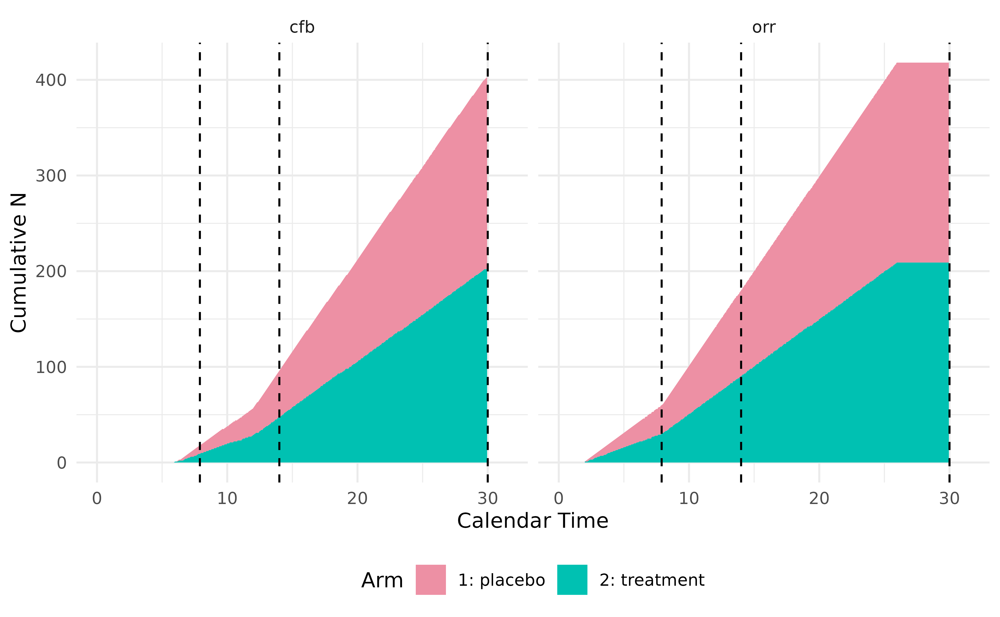

# Define Non-Time-to-Event Endpoints

`TrialSimulator` provides a flexible framework for defining and
simulating a variety of clinical trial endpoints by specifying the
`type` parameter in `endpoint`. This vignette covers non-time-to-event
(non-TTE) endpoints, demonstrating how they can be defined, integrated
into trial arms, and analyzed at pre-specified milestones. For
time-to-event endpoints, please refer to the vignette [Define
Time-to-Event Endpoints in Clinical
Trials](https://zhangh12.github.io/TrialSimulator/articles/defineTimeToEventEndpoints.md).
For longitudinal endpoints, please refer to the vignette [Define
Longitudinal Endpoints in Clinical
Trials](https://zhangh12.github.io/TrialSimulator/articles/defineLongitudinalEndpoints.md)

This vignette demonstrates how to use the following key functions to
define non-TTE endpoints. For the sake of completeness, we also
demonstrates how to define arms and trial with the created endpoints

- `endpoint`: Creates one or more endpoints. It can also be used to
  define covariates, bio-markers, sub-group indicators, etc.
- `arm`: Creates one or more arms
- `add_endpoints`: Add one or more endpoints to an arm
- `milestone`: Defines one or more milestones when data snapshots are
  needed for analysis

## Define endpoints with random number generators

Similar to time-to-event endpoints, non-TTE endpoints can be defined
using any univariate random number generator that takes `n` (number of
observations) as its first argument. The `stats` package provides a set
of random number generators that can be assigned to `generator` in
`endpoints`, where additional arguments required by `generator` can be
passed through `...`. When creating non-TTE endpoints, the argument
`type` should be set to `"non-tte"`, and the argument `readout` should
be specified as a named numeric vector, indicating the time required for
the endpoint to be available for analysis after patient enrollment.

In the example below, we define two types of endpoints:

- Continuous endpoint: Tumor size change from baseline (`cfb`),
  available after 6 months, assuming a normal distribution
  (`generator = rnorm`) with custom `mean` and `sd`.

- Binary endpoint: Objective response rate (`orr`), available after 2
  months, assuming a binomial distribution (`generator = rbinom`) with
  `size = 1` and custom `prob`.

``` r
## endpoints in placebo arm
tumor_cfb_pbo <- endpoint(name = 'cfb', type = 'non-tte', 
                          readout = c(cfb = 6),
                          generator = rnorm, mean = .8, sd = 3.2)
orr_pbo <- endpoint(name = 'orr', type = 'non-tte', 
                    readout = c(orr = 2),
                    generator = rbinom, size = 1, prob = .1)

## define the placebo arm
pbo <- arm(name = 'placebo')
pbo$add_endpoints(tumor_cfb_pbo, orr_pbo)

## endpoints in treatment arm
tumor_cfb_trt <- endpoint(name = 'cfb', type = 'non-tte', 
                          readout = c(cfb = 6), 
                          generator = rnorm, mean = -2.3, sd = 1.5)
orr_trt <- endpoint(name = 'orr', type = 'non-tte', 
                    readout = c(orr = 2), 
                    generator = rbinom, size = 1, prob = .25)

## define the treatment arm
trt <- arm(name = 'treatment')
trt$add_endpoints(tumor_cfb_trt, orr_trt)
```

With the treatment arms defined, we can proceed to create a trial.
Patients are recruited at a piecewise constant rate, with an accrual
pattern as follows:

- First 6 months: 10 patients per month.
- After 6 months: 20 patients per month until 420 patients are
  randomized 1:1 into the two arms.

We also specify a dropout process with a Weibull distribution. The
dropout rates are set as follows:

- 15% dropout at 12 months
- 30% dropout at 18 months

These constraints are resolved using the Weibull dropout function:

$$\begin{array}{rlr}
0.15 & = & {1 - e^{- {(12/\lambda)}^{k}}} \\
0.30 & = & {1 - e^{- {(18/\lambda)}^{k}}}
\end{array}$$

``` r
dropout_pars <- weibullDropout(c(12, 18), c(.15, .30))
dropout_pars
#>     shape     scale 
#>  1.938589 30.635696
```

Using the computed scale parameter $\lambda =$ 30.636 and shape
parameter $k =$ 1.939, we specify the trial setup:

``` r
accrual_rate <- data.frame(end_time = c(6, Inf), 
                           piecewise_rate = c(10, 20))

trial <- trial(
  name = 'Trial-31415', description = 'Example Clinical Trial', 
  n_patients = 420, duration = 30, 
  enroller = StaggeredRecruiter, accrual_rate = accrual_rate, 
  dropout = rweibull, scale = 30.636, shape = 1.939
)
#> Seed is not specified. TrialSimulator sets it to 1012203595

## add arms to the trial
trial$add_arms(sample_ratio = c(1, 1), trt, pbo)
#> Arm(s) <treatment, placebo> are added to the trial.
#> Randomization is done for 420 potential patients.
#> Data of 420 potential patients are generated for the trial with 2 arm(s) <treatment, placebo>.
trial
#>  ⚕⚕ Trial Name:  Trial-31415  
#>  ⚕⚕ Description:  Example Clinical Trial  
#>  ⚕⚕ Number of Arms:  2  
#>  ⚕⚕ Registered Arms:  treatment, placebo  
#>  ⚕⚕ Sample Ratio:  1, 1  
#>  ⚕⚕ Number of Patients:  420  
#>  ⚕⚕ Planned Duration:  30  
#>  ⚕⚕ Random Seed:  1012203595
```

Here `accrual_rate` is an argument of
[`TrialSimulator::StaggeredRecruiter`](https://zhangh12.github.io/TrialSimulator/reference/StaggeredRecruiter.md)
controlling how patients are recruited into the trial. Similarly,
`scale` and `shape` are arguments of `rweibull`. All these arguments are
passed through `...` of
[`trial()`](https://zhangh12.github.io/TrialSimulator/reference/trial.md).

`TrialSimulator` allows defining trial milestones at specific time
points when data is locked for analysis. Here, we define three key
milestones:

1.  Interim Analysis: Triggered when `orr` has been observed for 60
    patients.
2.  Random Checkpoint: For illustration purpose only. Triggered when the
    trial has reached at least 10 months, and at least one of the
    following conditions is met:
    - `cfb` has been observed for at least 100 patients,
    - `orr` has been observed for at least 180 patients.
3.  Final Analysis: Occurs when the trial reaches 30 months.

``` r
interim <- milestone(name = 'interim', 
                     when = eventNumber(endpoint = 'orr', n = 60), 
                     action = doNothing)

random <- milestone(name = 'random', 
                    when = 
                      calendarTime(time = 10) & 
                      (eventNumber(endpoint = 'cfb', n = 100) | 
                         eventNumber(endpoint = 'orr', n = 180)
                       ), 
                    action = doNothing)

final <- milestone(name = 'final', 
                   when = calendarTime(time = 30), 
                   action = doNothing)
```

Here `action = doNothing` in `milestone` means we don’t expect any
action at the time of triggered milestones. In practice, instead of
`doNothing`, custom action function can be adopted to add or remove arms
(e.g., dose selection), adjust sample ratio per arm, or carry out
statistical analysis based on locked data. These advanced setups are
covered in other vignettes.

Next, we register the milestones with a listener and create a controller
to monitor and execute the trial.

``` r
## register milestones to the listener
listener <- listener()
listener$add_milestones(interim, random, final)
#> A milestone <interim> is registered.
#> A milestone <random> is registered.
#> A milestone <final> is registered.

## run the trial
controller <- controller(trial, listener)
controller$run()
#> Condition of milestone <interim> is being checked.
#> Data is locked at time = 7.9 for milestone <interim>.
#> Locked data can be accessed in Trial$get_locked_data('interim'). 
#> Number of events at lock time:
#>   patient cfb orr         arms
#> 1      99  18  60 c(50, 9,....
#> 
#> Condition of milestone <random> is being checked.
#> Data is locked at time = 14 for milestone <random>.
#> Locked data can be accessed in Trial$get_locked_data('random'). 
#> Number of events at lock time:
#>   patient cfb orr         arms
#> 1     221  96 180 c(110, 4....
#> 
#> Condition of milestone <final> is being checked.
#> Data is locked at time = 30 for milestone <final>.
#> Locked data can be accessed in Trial$get_locked_data('final'). 
#> Number of events at lock time:
#>   patient cfb orr         arms
#> 1     420 403 418 c(210, 2....
#> 
#> Ignoring unknown labels:
#> • colour : ""
```



We can inspect the dataset locked at different milestone by calling
member function `get_locked_data` with milestone names. Ideally, this
should be done within custom action function, where decision is made
based on data locked at the time of a milestone.

``` r
interim_data <- trial$get_locked_data(milestone_name = 'interim')
random_data <- trial$get_locked_data(milestone_name = 'random')
final_data <- trial$get_locked_data(milestone_name = 'final')
head(interim_data)
#>   patient_id       arm enroll_time dropout_time       cfb cfb_readout orr
#> 1          1 treatment         0.0    21.180883 -4.434289           6   0
#> 2          2   placebo         0.1     2.977640        NA           6   0
#> 3          3   placebo         0.2    28.175451 -1.657398           6   1
#> 4          4 treatment         0.3    27.254577  1.004898           6   0
#> 5          5 treatment         0.4     5.663727        NA           6   0
#> 6          6   placebo         0.5    27.379476  6.093597           6   0
#>   orr_readout
#> 1           2
#> 2           2
#> 3           2
#> 4           2
#> 5           2
#> 6           2
```

Since `cfb` has a 6-month readout time, at interim analysis, some
patients’ `cfb` values are still unavailable, appearing as `NA` in
`interim_data.` However, these values become available in `random_data`
collected at a later time point. This demonstrates how `TrialSimulator`
properly and automatically handles endpoint availability at different
milestones

``` r
not_ready_at_interim <- 
  interim_data %>% 
  dplyr::filter(is.na(cfb) & 
                  is.na(orr) & 
                  enroll_time + 6 < dropout_time) %>% 
  head() %>% 
  print()
#>   patient_id       arm enroll_time dropout_time cfb cfb_readout orr orr_readout
#> 1         61 treatment        6.00     22.58184  NA           6  NA           2
#> 2         62   placebo        6.05     62.17731  NA           6  NA           2
#> 3         63 treatment        6.10     23.76025  NA           6  NA           2
#> 4         64   placebo        6.15     29.50080  NA           6  NA           2
#> 5         66   placebo        6.25     26.44169  NA           6  NA           2
#> 6         67   placebo        6.30     25.48133  NA           6  NA           2

random_data %>% 
  dplyr::filter(patient_id %in% not_ready_at_interim$patient_id) %>% 
  print()
#>   patient_id       arm enroll_time dropout_time       cfb cfb_readout orr
#> 1         61 treatment        6.00     22.58184 -1.167254           6   0
#> 2         62   placebo        6.05     62.17731 -3.808641           6   0
#> 3         63 treatment        6.10     23.76025 -4.813609           6   0
#> 4         64   placebo        6.15     29.50080  1.547169           6   0
#> 5         66   placebo        6.25     26.44169 -3.164815           6   0
#> 6         67   placebo        6.30     25.48133 -3.931915           6   0
#>   orr_readout
#> 1           2
#> 2           2
#> 3           2
#> 4           2
#> 5           2
#> 6           2
```

In this example, we simulate tumor size change from baseline (`cfb`).
However, in many trials, it is more appropriate to simulate tumor size
at both baseline and follow-up separately to allow for more complex
modeling, such as longitudinal or repeated measures analysis. This will
be covered in another vignette.

With this flexible setup, `TrialSimulator` enables efficient endpoint
definition, adaptive trial execution, and data monitoring—allowing users
to design and simulate clinical trials tailored to specific research
needs.
