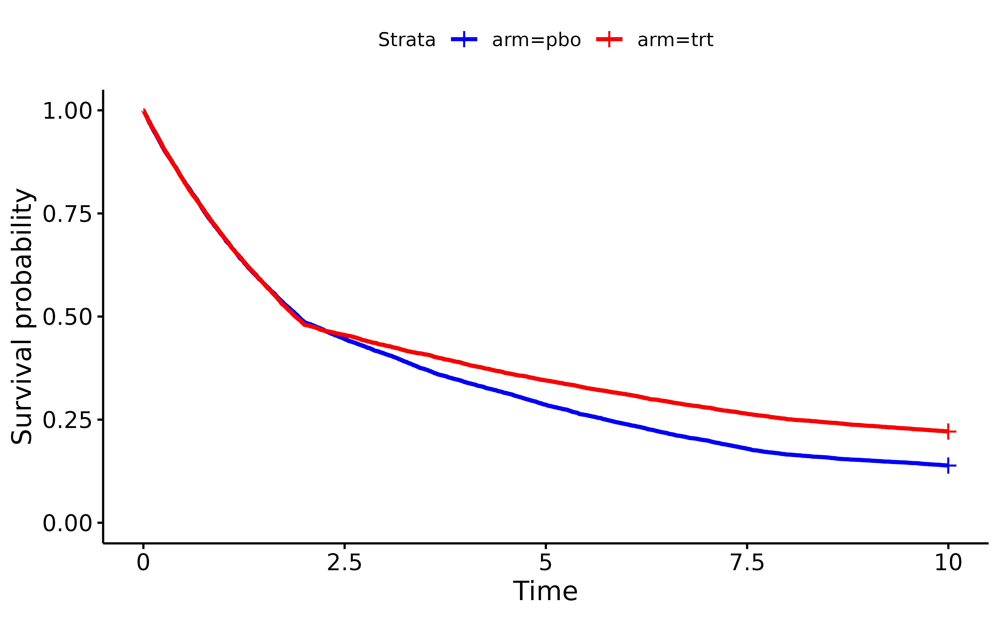

# Define Time-to-Event Endpoints

The first step in simulating a randomized clinical trial using
`TrialSimulator` is to define one or more endpoints for each treatment
arm. This vignette demonstrates how to use the following key functions
to define time-to-event endpoints. For non-time-to-event endpoints,
please refer to the separate vignette [Define Non-Time-to-Event
Endpoints in Clinical
Trials](https://zhangh12.github.io/TrialSimulator/articles/defineNonTimeToEventEndpoints.md).

- `endpoint`: Creates one or more endpoints
- `test_generator`: Generates an example dataset from an `Endpoints`
  object

Typically, endpoints follow the same distribution family across arms but
with different parameters. Distribution parameters are specified through
the `...` arguments in `endpoint`. However, please note that `endpoint`
offers the flexibility to specify different distribution families across
arms for endpoints.

Note that the function `test_generator` is for helping users
understanding how `TrialSimulator` works. In formal simulation, we do
not need to call this function.

For the sake of completeness, in this vignette, we also demonstrates how
to define an arm with the created endpoints by using the following key
functions:

- `arm`: Creates one or more arms
- `add_endpoints`: Add one or more endpoints into an arm

## Define a univariate endpoint with random number generators from `stats`

To define a time-to-event endpoint such as progression-free survival
(`PFS`) following an exponential distribution, we need to specify its
`name` and `type.` This specification is crucial because
`TrialSimulator` ensures all arms have the same set of endpoints and
manages endpoint data based on `type`. For example, endpoints of type
`"tte"` (time-to-event) automatically receive an additional column
`(name)_event` to indicate censoring status.

``` r

pfs_pbo <- endpoint(name = 'PFS', type = 'tte', 
                    generator = rexp, rate = log(2)/5.6)
```

Arguments for the generator function (in this case, `rate`) are passed
through `...`. We can verify that the generator works as expected by
requesting an example dataset:

``` r

test_set <- pfs_pbo$test_generator(n = 1e5)
head(test_set)
#>          PFS PFS_event
#> 1  6.5316820         1
#> 2  0.1490485         1
#> 3  3.6793035         1
#> 4  0.1933984         1
#> 5 51.7238773         1
#> 6 10.1631791         1
median(test_set$PFS) ## should be close to 5.6
#> [1] 5.592334
```

Note that data returned by `test_generator` is only for validation
purposes. During actual trial simulation, `TrialSimulator` determines
when to call `generator` from which how many samples to draw. To request
access of a data locked at a milestone, we can use the member function
`get_locked_data` of a `Trials` object which will be introduced in the
vignette [An Example of Simulating a Trial with Adaptive
Design](https://zhangh12.github.io/TrialSimulator/articles/adaptiveDesign.md).

We can get a summary report by printing an `endpoint` object

``` r

pfs_pbo
```

CjwhRE9DVFlQRSBodG1sPgo8aHRtbD4KPGhlYWQ+CiAgICA8bWV0YSBjaGFyc2V0PSJVVEYtOCI+CiAgICA8dGl0bGU+RW5kcG9pbnRzICgxKTwvdGl0bGU+CiAgICA8c3R5bGU+CiAgICAgICAgYm9keSB7CiAgICAgICAgICAgIGZvbnQtZmFtaWx5OiBBcmlhbCwgc2Fucy1zZXJpZjsKICAgICAgICAgICAgbWFyZ2luOiAyMHB4OwogICAgICAgICAgICBiYWNrZ3JvdW5kLWNvbG9yOiB3aGl0ZTsKICAgICAgICAgICAgZGlzcGxheTogZmxleDsKICAgICAgICAgICAgZmxleC1kaXJlY3Rpb246IGNvbHVtbjsKICAgICAgICAgICAgYWxpZ24taXRlbXM6IGNlbnRlcjsKICAgICAgICB9CiAgICAgICAgaDEgewogICAgICAgICAgICBjb2xvcjogYmxhY2s7CiAgICAgICAgICAgIHRleHQtYWxpZ246IGNlbnRlcjsKICAgICAgICAgICAgbWFyZ2luLWJvdHRvbTogMjBweDsKICAgICAgICAgICAgZm9udC1zaXplOiAyMHB4OwogICAgICAgIH0KICAgICAgICAuc3VidGl0bGUgewogICAgICAgICAgICB0ZXh0LWFsaWduOiBjZW50ZXI7CiAgICAgICAgICAgIGNvbG9yOiAjNjY2OwogICAgICAgICAgICBtYXJnaW4tYm90dG9tOiAyMHB4OwogICAgICAgICAgICBmb250LXNpemU6IDE2cHg7CiAgICAgICAgfQogICAgICAgIHRhYmxlIHsKICAgICAgICAgICAgYm9yZGVyLWNvbGxhcHNlOiBjb2xsYXBzZTsKICAgICAgICAgICAgZm9udC1zaXplOiAxNHB4OwogICAgICAgICAgICBib3JkZXI6IDFweCBzb2xpZCAjOTk5OwogICAgICAgICAgICB3aWR0aDogYXV0bzsKICAgICAgICAgICAgbWFyZ2luOiAwIGF1dG87CiAgICAgICAgfQogICAgICAgIHRoIHsKICAgICAgICAgICAgYmFja2dyb3VuZC1jb2xvcjogI2YwZjBmMDsKICAgICAgICAgICAgY29sb3I6IGJsYWNrOwogICAgICAgICAgICBwYWRkaW5nOiAxMHB4OwogICAgICAgICAgICB0ZXh0LWFsaWduOiBsZWZ0OwogICAgICAgICAgICBmb250LXdlaWdodDogbm9ybWFsOwogICAgICAgICAgICBib3JkZXI6IDFweCBzb2xpZCAjOTk5OwogICAgICAgICAgICB3aGl0ZS1zcGFjZTogbm93cmFwOwogICAgICAgICAgICBmb250LXNpemU6IDE0cHg7CiAgICAgICAgfQogICAgICAgIHRkIHsKICAgICAgICAgICAgcGFkZGluZzogMTBweDsKICAgICAgICAgICAgYm9yZGVyOiAxcHggc29saWQgIzk5OTsKICAgICAgICAgICAgdmVydGljYWwtYWxpZ246IHRvcDsKICAgICAgICAgICAgbGluZS1oZWlnaHQ6IDEuNDsKICAgICAgICAgICAgZm9udC1zaXplOiAxNHB4OwogICAgICAgIH0KICAgICAgICAubm8tY29sIHsKICAgICAgICAgICAgdGV4dC1hbGlnbjogY2VudGVyOwogICAgICAgICAgICB3aGl0ZS1zcGFjZTogbm93cmFwOwogICAgICAgIH0KICAgICAgICAudmFyaWFibGUtY29sIHsKICAgICAgICAgICAgd2hpdGUtc3BhY2U6IG5vd3JhcDsKICAgICAgICB9CiAgICAgICAgLnN0YXRzLWNvbCB7CiAgICAgICAgfQogICAgICAgIC5mcmVxcy1jb2wgewogICAgICAgICAgICBsaW5lLWhlaWdodDogMjBweDsKICAgICAgICB9CiAgICAgICAgLmdyYXBoLWNvbCB7CiAgICAgICAgICAgIHRleHQtYWxpZ246IGNlbnRlcjsKICAgICAgICAgICAgd2hpdGUtc3BhY2U6IG5vd3JhcDsKICAgICAgICAgICAgdmVydGljYWwtYWxpZ246IHRvcDsKICAgICAgICB9CiAgICAgICAgaW1nIHsKICAgICAgICAgICAgZGlzcGxheTogYmxvY2s7CiAgICAgICAgICAgIG1hcmdpbjogMCBhdXRvOwogICAgICAgICAgICB2ZXJ0aWNhbC1hbGlnbjogdG9wOwogICAgICAgIH0KICAgIDwvc3R5bGU+CjwvaGVhZD4KPGJvZHk+CiAgICA8aDE+RW5kcG9pbnRzICgxKTwvaDE+CiAgICA8ZGl2IGNsYXNzPSJzdWJ0aXRsZSIgc3R5bGU9InRleHQtYWxpZ246IGxlZnQ7Ij4KICAgICAgICBQRlM8YnI+CiAgICA8L2Rpdj4KCiAgICA8dGFibGU+CiAgICAgICAgPHRoZWFkPgogICAgICAgICAgICA8dHI+CiAgICAgICAgICAgICAgICA8dGggY2xhc3M9Im5vLWNvbCI+Tm88L3RoPgogICAgICAgICAgICAgICAgPHRoIGNsYXNzPSJ2YXJpYWJsZS1jb2wiPlZhcmlhYmxlPC90aD4KICAgICAgICAgICAgICAgIDx0aCBjbGFzcz0ic3RhdHMtY29sIj5TdGF0cyAvIEZyZXFzPC90aD4KICAgICAgICAgICAgICAgIDx0aCBjbGFzcz0iZ3JhcGgtY29sIj5HcmFwaDwvdGg+CiAgICAgICAgICAgIDwvdHI+CiAgICAgICAgPC90aGVhZD4KICAgICAgICA8dGJvZHk+CiAgICAgICAgICAgIDx0cj4KICAgICAgICAgICAgICAgIDx0ZCBjbGFzcz0ibm8tY29sIj4xPC90ZD4KICAgICAgICAgICAgICAgIDx0ZCBjbGFzcz0idmFyaWFibGUtY29sIj5QRlM8YnI+W3RpbWUtdG8tZXZlbnRdPC90ZD4KICAgICAgICAgICAgICAgIDx0ZCBjbGFzcz0ic3RhdHMtY29sIj5NZWRpYW4gdGltZTogNS41Mjxicj5FdmVudHM6IDEwMDAwPGJyPk1pc3Npbmc6IDAgKDAlKTwvdGQ+CiAgICAgICAgICAgICAgICA8dGQgY2xhc3M9ImdyYXBoLWNvbCI+PGltZyBzcmM9ImRhdGE6aW1hZ2UvcG5nO2Jhc2U2NCxpVkJPUncwS0dnb0FBQUFOU1VoRVVnQUFBSGdBQUFCUUNBTUFBQURsUlVHN0FBQUMwMUJNVkVVRUJBUUhCd2NKQ1FrTURBd09EZzRQRHc4UUVCQVJFUkVTRWhJVEV4TVVGQlFWRlJVV0ZoWVhGeGNZR0JnWkdSa2FHaG9iR3hzY0hCd2RIUjBnSUNBaUlpSW5KeWNvS0NncEtTa3FLaW91TGk0eE1URXlNakl6TXpNME5EUTJOalk3T3pzOFBEdzlQVDArUGo1QlFVRkNRa0pEUTBORVJFUkZSVVZHUmtaSFIwZElTRWhLU2twTFMwdE1URXhOVFUxUlVWRlNVbEpUVTFOVlZWVllXRmhhV2xwYlcxdGNYRnhlWGw1aFlXRmtaR1JtWm1acWFtcHJhMnRzYkd4dWJtNXZiMjl4Y1hGeWNuSjBkSFIxZFhWMmRuWjNkM2Q0ZUhoNWVYbDZlbnA3ZTN0OGZIeDlmWDErZm42QmdZR0Nnb0tEZzRPRWhJU0ZoWVdGbk5pR2hvYUhoNGVJaUlpSmlZbUtpYU9LaW9xTGk0dU1qSXlOalkyUGo0K1FrSkNTaW5TU2twS1ltSmlabVptWm5hMmNuSnlkbloyZm41K2dvS0Npb3FLam82T2tvYlNrcEtTbHBhV25uTHVvbXJxcW03cXFxcXFycmE2dHBidXVxc0N1cnE2dnI2K3Zzc3V2dGMyeHNiR3lzckt6czdPMHRMUzF0YlcxdHJhMnNNVzJ0cmEzcGJTM3Q3ZTN2dFM0cEtLNHNzZTR1TGk0dWJtNHU5QzV1YnE1djlXNnVycTd1N3U4b1p1OHZMeTl5ZUM5ME9pK3BiTytxYk8vcExLL3Y3L0FyTFhBd01EQTArckMrZi9FclpmRXhNVEdzYTdHeHNiSnljbkt5c3JMeTh2TDBNM016TXpOczYzTjBzN096czdQdUxUUHo4L1F6YzNRME5EUnVyZlIwZEhSKy8vVDA5UFYxZFhXMXRiVzJmSFgxOWZZdDcvWTJOalovUC9iMjl2Yi9QL2QzZDNlM3Q3Zi9QL2cvUC9pemREaTR1TGo0K1BrNU9UbDVlWG16cnptNXVibSt2TG0vZi9uNStmbi9mL28wYi9vNWVqbzZPam8vZi9wNmVucjYrdnMzT0xzNnV6cy92L3Q2dGp1N3U3dS92L3Y3Ky92L3YvdytmL3krdi95Ly8vejZ1eno4L1AwOVBUMCsvLzExN0QxOWZYMTl2NzI5dmIzOS9mNS8vLzY4dTc2K3ZyNi8vLzcrL3Y3Ly8vODl2RDgvUHo5NXVQOS9mMys2YjcrN3V6Ky92Ny8rTzcvK2ZILytmai8rL1QvLy9mLy8vOWJoajIrQUFBQUNYQklXWE1BQUE3REFBQU93d0hIYjZoa0FBQURJMGxFUVZSb2dlM1krVmRNWVJnSDhLdWtETTJNeUpJU1NXTVprclJvN0V0RlNLU0VVbU5KMWl3UnlnaGx5WjQ5a1NXRTdGbG5za2NpZThpV0pSSHkvQW1hbWViT3ZUVXpMbWZlOS8xbHZyL2MrWjQ3Y3o3M3ZIUHVQZTk5S0NBVXlnUmpneXNMWDVHQlorL2JkSXdJbkNmYjhGeFRZb0o5QVJSNzhNQUEzeDlwU25ndkM0QUVNUjc0MjdSVmQrbW1FQUxJQlhqZzMyOFlUUWxEZzN0WVlGWlR3YUsxaE9DQm9ZVGc2WjZFNEJQTkNjRmw5UjZUZ2FGRE1nNTQzY1M1WjJ2QUFZRTQ0UDF6RnR6U2xOd2thK1ZCMWdrSERQRDFocWE0MjVrcER3VzhDZ3p3MXBTVmwraW1YbXBvZWdvRGZDaHgrWU9hY0k5SkdHQldxNFpuZENjRVg3TXVKd09EWFJZaGVGQXdJWGk5TXlHNHhMSVlPWHg0OTBMMjFrY1YxL25JNFoxajVwMnZEVWY1SUllWmowd25penJWbjY0SVVkOVExTkdVTmZTVHF5U0gzbUU2WktDR055Y3V2VWczZXFsaDZERFVNS3RwNFN6VSt4OTlNTFE0U0FnTzdFc0l2aXI0UkFhR2R2R0U0Q251YU9FdkQwKysxd2tYODVDK3ZGR3ZKNHg2b2hNR256Q2tNUHk0VHo4eSszY3haNXc2TG55SEVyNjlldnRuVFVtVDhwam4zQ0pRd3JNT2JORU9YMWhMRFVjYXZVUUkvN3p6Vk52WU1IajRJWVJaclFhY3p6dERCb1pJSjJRdk00Ymhja2NwR1JpeUc4ckp3REJjaEdnUFJIMTQ5a3YzSTFPZDBqYUkzdEtwbVN1VzdUQUFnNEtmaGdhK2ZQMDBQWXFJQzdXcS9ZMVVQcEo3aXFvc2ZFRVBVVWQ0MWRYeGxhbjhiQlF3YTE2dFk2bXJFbXR6RGdHY0o5djQ4Uzh3VEJha0d4OW1OVDB3eUFTampYMVhjWU5CNGR6V3lNdk5FWWF5U0V1UHZTUmdnS0x4alYxbHh0dnljb2NCM2tZNUNuc3V1b2tmcmtwT2NIdXJsdjNpaTR3QTY1cnNHVXpadGlBWGN4c25iNytJdUV4NXlmL0R6TWxlZmpxZjI2OHFMcVJGQi9YcGJDODBvK28zYXlVU2Uwb2tBL3hEUWlLbDBwaFlWWmFrcXJNclU1dGNaZWcvaWpVUkVEZXgrZGNMTHkzSXlVaGRIQ09WaG8zMDllMHRrWGk1cXlJV3FkUGFnWTY5clRJdU5NeGFhb3hoRDFHVkNiZTAxVVpnM05LUkFkZTZsR2kzWEczR2RXV1VzVzc2U2xnM1RpWFUyeENjN0srdkpBM1dWMlJET0pXRUFFTXdwcGhnRTJ5Q1RiQUo1cHcvWUo2MDdyd1VQT01BQUFBQVNVVk9SSzVDWUlJPSIgYWx0PSJLTSBjdXJ2ZSI+PC90ZD4KICAgICAgICAgICAgPC90cj4KICAgICAgICAgICAgPHRyPgogICAgICAgICAgICAgICAgPHRkIGNsYXNzPSJuby1jb2wiPjI8L3RkPgogICAgICAgICAgICAgICAgPHRkIGNsYXNzPSJ2YXJpYWJsZS1jb2wiPlBGU19ldmVudDxicj5bZXZlbnQgaW5kaWNhdG9yXTwvdGQ+CiAgICAgICAgICAgICAgICA8dGQgY2xhc3M9InN0YXRzLWNvbCI+MTogMTAwMDAgKDEwMCUpPGJyPk1pc3Npbmc6IDAgKDAlKTwvdGQ+CiAgICAgICAgICAgICAgICA8dGQgY2xhc3M9ImdyYXBoLWNvbCI+PGltZyBzcmM9ImRhdGE6aW1hZ2UvcG5nO2Jhc2U2NCxpVkJPUncwS0dnb0FBQUFOU1VoRVVnQUFBSGdBQUFBb0NBTUFBQUFDTk00WEFBQUFMVkJNVkVXWm1abW9xS2lycTZ1dHJhMndzTEMydHJhNXVibS92Ny9JeU1qTnpjM1QwOVBmMzkvbDVlWHI2K3YvLy8vVCtzUStBQUFBQ1hCSVdYTUFBQTdEQUFBT3d3SEhiNmhrQUFBQVNVbEVRVlJZaGUzV3VRR0FNQkRFd09VSFA5ZC91UzVEQkZJRGt5b0ZsUkdvdmplaVMxaFlXRmhZK0kvdzloS2RtUWRUc1BYQjRQbEJjTCtGaFlXRmhZV0ZhWGc4RU15d1ZRdmtVTnAwSGJFSm1RQUFBQUJKUlU1RXJrSmdnZz09IiBhbHQ9ImJhcnBsb3QiIHN0eWxlPSJoZWlnaHQ6IGF1dG87IHdpZHRoOiAxMjBweDsiPjwvdGQ+CiAgICAgICAgICAgIDwvdHI+CiAgICAgICAgPC90Ym9keT4KICAgIDwvdGFibGU+CjwvYm9keT4KPC9odG1sPgo=

Similarly, we can define a `PFS` endpoint for the treatment arm:

``` r

pfs_trt <- endpoint(name = 'PFS', type = 'tte', 
                    generator = rexp, rate = log(2)/6.4)
median(pfs_trt$test_generator(n = 1e5)$PFS) ## should be close to 6.4
#> [1] 6.444728
```

Now we can define the placebo and treatment arms by adding the `PFS`
endpoints:

``` r

pbo <- arm(name = 'placebo')
pbo$add_endpoints(pfs_pbo)
trt <- arm(name = 'treatment')
trt$add_endpoints(pfs_trt)
```

We will cover how to create a trial object based on arms `pbo` and `trt`
in another vignette.

## Define a univariate endpoint with custom random number generators

`endpoints` accepts custom random number generators for univariate
random variables, as long as the generator’s first argument is `n`
(number of observations). Additional arguments can be passed through
`...` in `endpoints`.

`TrialSimulator` provides a built-in custom generator,
`PiecewiseConstantExponentialRNG`, to generate time-to-event endpoints
from piecewise constant exponential distributions. This is particularly
useful for simulating lagged or delayed treatment effects. The example
below demonstrates a scenario where treatment effect begins at week 2:

``` r

risk_pbo <- data.frame(
  end_time = c(2, 8, 10), 
  piecewise_risk = c(1, 0.48, 0.25) * exp(-1)
)

pfs_pbo <- endpoint(name = 'PFS', type = 'tte', 
                    generator = PiecewiseConstantExponentialRNG, 
                    risk = risk_pbo, 
                    endpoint_name = 'PFS')
risk_trt <- risk_pbo %>% 
  mutate(hazard_ratio = c(1, .6, .7))

pfs_trt <- endpoint(name = 'PFS', type = 'tte', 
                    generator = PiecewiseConstantExponentialRNG, 
                    risk = risk_trt, 
                    endpoint_name = 'PFS')

test_set <- rbind(pfs_pbo$test_generator(n = 1e4) %>% mutate(arm = 'pbo'), 
                  pfs_trt$test_generator(n = 1e4) %>% mutate(arm = 'trt'))

sfit <- survfit(Surv(time = PFS, event = PFS_event) ~ arm, test_set)
ggsurvplot(sfit, data = test_set, palette = c("blue", "red"))
```



In this example, `PiecewiseConstantExponentialRNG` adds a column
`PFS_event` because we specified `endpoint_name = 'PFS'`. Some patients
have their `PFS` censored (`PFS_event = 0`). By default, when a custom
generator is supplied and an event column is not provided for a
time-to-event endpoint, `TrialSimulator` will add one and set all values
to 1 (no censoring).

``` r

head(test_set %>% slice_sample(prop = 1))
#>          PFS PFS_event arm
#> 1 10.0000000         0 trt
#> 2  4.5502723         1 trt
#> 3  3.9635839         1 pbo
#> 4  0.9192734         1 trt
#> 5  3.8969154         1 pbo
#> 6 10.0000000         0 pbo
```

To add endpoint to an arm,

``` r

pbo <- arm(name = 'placebo')
pbo$add_endpoints(pfs_pbo)

trt <- arm(name = 'treatment')
trt$add_endpoints(pfs_trt)
```

## Define multiple endpoints

We can define more than one endpoint in a trial. Let’s add overall
survival (OS) as a second endpoint. We’ll assume the median overall
survival is 7.2 months in the placebo arm and 8.5 months in the
treatment arm.

``` r

os_pbo <- endpoint(name = 'OS', type = 'tte', 
                   generator = rexp, rate = log(2)/7.2)
os_trt <- endpoint(name = 'OS', type = 'tte', 
                   generator = rexp, rate = log(2)/8.5)

median(os_pbo$test_generator(n = 1e5)$OS) ## should be close to 7.2
#> [1] 7.170061
median(os_trt$test_generator(n = 1e5)$OS) ## should be close to 8.5
#> [1] 8.547774

## add endpoint to existing arms
pbo$add_endpoints(os_pbo)
trt$add_endpoints(os_trt)
```

Note that by defining `PFS` and `OS` separately (i.e., calling
`endpoints` for each endpoint), we are implicitly assuming that these
endpoints are independent in the trial.

## An example of a custom random number generator for correlated endpoints

To define multiple correlated endpoints, we need to create a custom
generator. In this example, we define one based on the R package
`simdata`:

``` r

custom_generator <- function(n, pfs_rate, os_rate, corr){
  
  dist <- list()
  dist[['PFS']] <- function(x) qexp(x, rate = pfs_rate)
  dist[['OS']] <- function(x) qexp(x, rate = os_rate)
  dsgn = simdata::simdesign_norta(cor_target_final = corr, 
                                dist = dist, 
                                transform_initial = data.frame,
                                names_final = names(dist), 
                                seed_initial = 1)
  
  simdata::simulate_data(dsgn, n_obs = n) %>% 
    mutate(PFS_event = 1, OS_event = 1) ## event indicators
}
```

Note that for custom generator, we need to add columns of event
indicator for each of the time-to-event endpoints.

``` r

corr <- matrix(c(1, .6, .6, 1), nrow = 2)
eps_pbo <- endpoint(name = c('PFS', 'OS'), type = c('tte', 'tte'), 
                    generator = custom_generator, 
                    pfs_rate = log(2)/5.6, os_rate = log(2)/7.2, 
                    corr = corr)

eps_trt <- endpoint(name = c('OS', 'PFS'), type = c('tte', 'tte'), 
                    generator = custom_generator, 
                    pfs_rate = log(2)/6.4, os_rate = log(2)/8.5, 
                    corr = corr)

test_set <- rbind(eps_pbo$test_generator(n = 1e5) %>% mutate(arm = 'pbo'), 
                  eps_trt$test_generator(n = 1e5) %>% mutate(arm = 'trt'))

with(test_set, cor(PFS, OS)) ## should be close to 0.6
#> [1] 0.5992274

## sample medians match to the parameters well
test_set %>% 
  group_by(arm) %>% 
  summarise(PFS = median(PFS), OS = median(OS))
#> # A tibble: 2 × 3
#>   arm     PFS    OS
#>   <chr> <dbl> <dbl>
#> 1 pbo    5.58  7.21
#> 2 trt    6.38  8.51
```

Instead of use `test_generator`, a simpler way to summarize an endpoint
object is to print it directly. For example, the two endpoints in the
placebo arm

``` r

eps_pbo
```

CjwhRE9DVFlQRSBodG1sPgo8aHRtbD4KPGhlYWQ+CiAgICA8bWV0YSBjaGFyc2V0PSJVVEYtOCI+CiAgICA8dGl0bGU+RW5kcG9pbnRzICgyKTwvdGl0bGU+CiAgICA8c3R5bGU+CiAgICAgICAgYm9keSB7CiAgICAgICAgICAgIGZvbnQtZmFtaWx5OiBBcmlhbCwgc2Fucy1zZXJpZjsKICAgICAgICAgICAgbWFyZ2luOiAyMHB4OwogICAgICAgICAgICBiYWNrZ3JvdW5kLWNvbG9yOiB3aGl0ZTsKICAgICAgICAgICAgZGlzcGxheTogZmxleDsKICAgICAgICAgICAgZmxleC1kaXJlY3Rpb246IGNvbHVtbjsKICAgICAgICAgICAgYWxpZ24taXRlbXM6IGNlbnRlcjsKICAgICAgICB9CiAgICAgICAgaDEgewogICAgICAgICAgICBjb2xvcjogYmxhY2s7CiAgICAgICAgICAgIHRleHQtYWxpZ246IGNlbnRlcjsKICAgICAgICAgICAgbWFyZ2luLWJvdHRvbTogMjBweDsKICAgICAgICAgICAgZm9udC1zaXplOiAyMHB4OwogICAgICAgIH0KICAgICAgICAuc3VidGl0bGUgewogICAgICAgICAgICB0ZXh0LWFsaWduOiBjZW50ZXI7CiAgICAgICAgICAgIGNvbG9yOiAjNjY2OwogICAgICAgICAgICBtYXJnaW4tYm90dG9tOiAyMHB4OwogICAgICAgICAgICBmb250LXNpemU6IDE2cHg7CiAgICAgICAgfQogICAgICAgIHRhYmxlIHsKICAgICAgICAgICAgYm9yZGVyLWNvbGxhcHNlOiBjb2xsYXBzZTsKICAgICAgICAgICAgZm9udC1zaXplOiAxNHB4OwogICAgICAgICAgICBib3JkZXI6IDFweCBzb2xpZCAjOTk5OwogICAgICAgICAgICB3aWR0aDogYXV0bzsKICAgICAgICAgICAgbWFyZ2luOiAwIGF1dG87CiAgICAgICAgfQogICAgICAgIHRoIHsKICAgICAgICAgICAgYmFja2dyb3VuZC1jb2xvcjogI2YwZjBmMDsKICAgICAgICAgICAgY29sb3I6IGJsYWNrOwogICAgICAgICAgICBwYWRkaW5nOiAxMHB4OwogICAgICAgICAgICB0ZXh0LWFsaWduOiBsZWZ0OwogICAgICAgICAgICBmb250LXdlaWdodDogbm9ybWFsOwogICAgICAgICAgICBib3JkZXI6IDFweCBzb2xpZCAjOTk5OwogICAgICAgICAgICB3aGl0ZS1zcGFjZTogbm93cmFwOwogICAgICAgICAgICBmb250LXNpemU6IDE0cHg7CiAgICAgICAgfQogICAgICAgIHRkIHsKICAgICAgICAgICAgcGFkZGluZzogMTBweDsKICAgICAgICAgICAgYm9yZGVyOiAxcHggc29saWQgIzk5OTsKICAgICAgICAgICAgdmVydGljYWwtYWxpZ246IHRvcDsKICAgICAgICAgICAgbGluZS1oZWlnaHQ6IDEuNDsKICAgICAgICAgICAgZm9udC1zaXplOiAxNHB4OwogICAgICAgIH0KICAgICAgICAubm8tY29sIHsKICAgICAgICAgICAgdGV4dC1hbGlnbjogY2VudGVyOwogICAgICAgICAgICB3aGl0ZS1zcGFjZTogbm93cmFwOwogICAgICAgIH0KICAgICAgICAudmFyaWFibGUtY29sIHsKICAgICAgICAgICAgd2hpdGUtc3BhY2U6IG5vd3JhcDsKICAgICAgICB9CiAgICAgICAgLnN0YXRzLWNvbCB7CiAgICAgICAgfQogICAgICAgIC5mcmVxcy1jb2wgewogICAgICAgICAgICBsaW5lLWhlaWdodDogMjBweDsKICAgICAgICB9CiAgICAgICAgLmdyYXBoLWNvbCB7CiAgICAgICAgICAgIHRleHQtYWxpZ246IGNlbnRlcjsKICAgICAgICAgICAgd2hpdGUtc3BhY2U6IG5vd3JhcDsKICAgICAgICAgICAgdmVydGljYWwtYWxpZ246IHRvcDsKICAgICAgICB9CiAgICAgICAgaW1nIHsKICAgICAgICAgICAgZGlzcGxheTogYmxvY2s7CiAgICAgICAgICAgIG1hcmdpbjogMCBhdXRvOwogICAgICAgICAgICB2ZXJ0aWNhbC1hbGlnbjogdG9wOwogICAgICAgIH0KICAgIDwvc3R5bGU+CjwvaGVhZD4KPGJvZHk+CiAgICA8aDE+RW5kcG9pbnRzICgyKTwvaDE+CiAgICA8ZGl2IGNsYXNzPSJzdWJ0aXRsZSIgc3R5bGU9InRleHQtYWxpZ246IGxlZnQ7Ij4KICAgICAgICBQRlMsIE9TPGJyPgogICAgPC9kaXY+CgogICAgPHRhYmxlPgogICAgICAgIDx0aGVhZD4KICAgICAgICAgICAgPHRyPgogICAgICAgICAgICAgICAgPHRoIGNsYXNzPSJuby1jb2wiPk5vPC90aD4KICAgICAgICAgICAgICAgIDx0aCBjbGFzcz0idmFyaWFibGUtY29sIj5WYXJpYWJsZTwvdGg+CiAgICAgICAgICAgICAgICA8dGggY2xhc3M9InN0YXRzLWNvbCI+U3RhdHMgLyBGcmVxczwvdGg+CiAgICAgICAgICAgICAgICA8dGggY2xhc3M9ImdyYXBoLWNvbCI+R3JhcGg8L3RoPgogICAgICAgICAgICA8L3RyPgogICAgICAgIDwvdGhlYWQ+CiAgICAgICAgPHRib2R5PgogICAgICAgICAgICA8dHI+CiAgICAgICAgICAgICAgICA8dGQgY2xhc3M9Im5vLWNvbCI+MTwvdGQ+CiAgICAgICAgICAgICAgICA8dGQgY2xhc3M9InZhcmlhYmxlLWNvbCI+UEZTPGJyPlt0aW1lLXRvLWV2ZW50XTwvdGQ+CiAgICAgICAgICAgICAgICA8dGQgY2xhc3M9InN0YXRzLWNvbCI+TWVkaWFuIHRpbWU6IDUuNTM8YnI+RXZlbnRzOiAxMDAwMDxicj5NaXNzaW5nOiAwICgwJSk8L3RkPgogICAgICAgICAgICAgICAgPHRkIGNsYXNzPSJncmFwaC1jb2wiPjxpbWcgc3JjPSJkYXRhOmltYWdlL3BuZztiYXNlNjQsaVZCT1J3MEtHZ29BQUFBTlNVaEVVZ0FBQUhnQUFBQlFDQU1BQUFEbFJVRzdBQUFDL1ZCTVZFVUVCQVFIQndjSUNBZ0pDUWtMQ3dzTURBd05EUTBPRGc0UER3OFJFUkVTRWhJVEV4TVVGQlFWRlJVWEZ4Y1lHQmdaR1JrYUdob2JHeHNjSEJ3ZEhSMGVIaDRmSHg4Z0lDQWhJU0VpSWlJakl5TWtKQ1FsSlNVcEtTa3FLaW90TFMwdUxpNHZMeTh3TURBeU1qSXpNek0wTkRRMk5qWTNOemM0T0RnOFBEdzlQVDFBUUVCQlFVRkNRa0pEUTBORVJFUkZSVVZHUmtaSFIwZElTRWhKU1VsS1NrcExTMHRNVEV4TlRVMU9UazVSVVZGU1VsSlRVMU5VVkZSVlZWVlhWMWRZV0ZoWldWbGJXMXRjWEZ4ZVhsNWZYMTloWVdGalkyTmxaV1ZtWm1acWFtcHJhMnRzYkd4dGJXMXVibTV3Y0hCeGNYRnljbkowZEhSM2QzZDRlSGg1ZVhsOGZIeUFnSUNDZ29LRGc0T0VoSVNGaFlXRm5OaUdob2FJaUlpSmlZbUtpYU9LaW9xTWpJeU5qWTJPam82UGo0K1FrSkNSa1pHU2luU1NrcEtUazVPVWxKU1ZsWldYbDVlWm1abVpuYTJjbkp5ZG5aMmZuNStnb0tDaG9hR2pvNk9rb2JTbHBhV25uTHVvbXJxcHFhbXFtN3FxcXFxcnE2dXJyYTZzckt5dHBidXVxc0N1cnE2dnI2K3Zzc3V2dGMyeHNiR3lzckt6czdPMHRMUzF0cmEyc01XMnRyYTNwYlMzdDdlM3Z0UzRwS0s0c3NlNHVMaTR1Ym00dTlDNXVibTV1YnE1djlXN3U3dThvWnU5dmIyOXllQzkwT2krcGJPK3FiTy9wTEsvdjcvQXJMWEF3TURBMCtyQ3dzTEMrZi9EdzhQRXJaZkV4TVRGeGNYR3NhN0d4c2JIeDhmS3lzckx5OHZMME0zTXpNek5zNjNOemMzTjBzN1B1TFRQejgvUXpjM1J1cmZSKy8vUzB0TFQwOVBXMXRiVzJmSFgxOWZZdDcvWi9QL2EydHJiMjl2Yi9QL2QzZDNlM3Q3ZjM5L2YvUC9nL1AvaXpkRGw1ZVhtenJ6bSt2TG0vZi9uNStmbi9mL28wYi9vNWVqbzZPam8vZi9xNnVycjYrdnMzT0xzNnV6cy92L3Q2dGp0N2UzdTd1N3Uvdi92Nysvdi92L3c4UER3K2YveSt2L3kvLy96NnV6ejgvUDA5UFQwKy8vMTE3RDE5ZlgxOXY3Mjl2YjQrUGo1K2ZuNS8vLzY4dTc2K3ZyNi8vLzcrL3Y3Ly8vODl2RDgvUHo5NXVQOS9mMys2YjcrN3V6Ky92Ny8rTzcvK2ZILytmai8rL1QvLy9mLy8vOXNseEgyQUFBQUNYQklXWE1BQUE3REFBQU93d0hIYjZoa0FBQURTa2xFUVZSb2dlM1llVlJNVVJ3SDhGZEpFeE9STmhJbFZKWVFvaGpaVWlGTFFpRnIyUWNwWTRuc1M1SWxXYkx2VVRFaVM5bEhLR3RLOXJVc0ZZbEV0dDlSTTgzcnZwcE1NdmZkZitiN3o3enZlVy9PNTgwOWMrNjc3MUpBS0pRU1pnMytsZnFhRER6bnlMWlRST0RFb0MwdnBjVnZtQ3RBUWhRN01NQzN4OUxpMVpNREVOcVNIZmpyalBWMzZaWlFBeUNGbTg4Sy9Qc2QwZ3BocUhPQkZaalJ4SEFYUDBMd1dCZENjSVE1SVRpamNqWVpHTXdPRTRLZEo3SUJiNTR5LzN3SldHRFBCbngwM3VKYjBpSUtyaWJtdFZtWVFncUcrc3NOYWVIVlZ4Ti9Hc2V5QU84S1dYdVZicEtoaHQ3ZUxNREhBMWZmTHdrSHRXSUJaclFpT0Uweml3d01GcnNKd1I0RENNRkNFMEp3bmxZeUdSZzYrMktIVHh4YXdsejZpTFBRR2p0OFlNU0NTNlhocktwUGNNUG9sR25KVVpFZTJ2dmdoaytHYktSbnJyZHgydExERlUxeHc5c0RWMTZoR3ozVWtLMTFFelBNYU1Vd09FNGdCTzgzSlFUbkcwV1RnY0hUbVJDY3hFMG5BME9uOFZqaHp3L092SmNOQy9Wd0x1eXBOK09HUHBVTmcvVlVuREI4djBkUG1mMXMxTkZ6NGJVeC9tVHE5b1k5bjZSbEo1L0xPR21GY2NLbVpoM2JVYno1d2h4cUNOZlB3QWYvdVBPOHVKV0FnZWVPRDJhMGtuQTg5eUlaR0VZMUl3VG5OcGhNQm9helhFelBDbmt3ek5WTndRTi9lUEd6akNtektHNU5jckRBTTllczJ2ZFhPSzlkTnh6djZkUzE2K2ZvclloRnc2dkl1Q1Rkb2hjR21mcVYrb3JlUkhYdnFpSHJta2VOSFhNVkR6UDJxMlVOZFVIUzJyWlErSnFUU2d6YStsRWVETG1EYWg1VU5NeG9aY0VBd2RvZWluMWdsQmVHeXgwTkF2Skl3QUJoRFkwRml2dVQvUU1NRUdwWmEwZ1NDUmdnMmtIVFpsSmtKdnN3d0RQZkhxWnFaazQrc2Y4NWtjcmMyWk9YakhCdmV5UFZlclo5dlFJaVlwTXJ0aUprN093bFJWUXYvemN6by94SHU5aWExOVdpT0lZbUZ1MTVEazc5QjNxTzRmTm4rd2Rza2tTSUpFWWtDVDBSTVhZRTJ1anJWT1RtSDRwaTlpNzFuOFlmT2RpMWo1TVRqMmRuSllrWkVsTkRTWnJUTUdPb1dReHpFN1V3WHBxR1NIUTAwS1pYQ1cwR3FtZ3pWRE5BbTdvdTJqaUNVbkNwVzVsdUowSWlNRWRibUQ3YTRsVFFKdElVb3MxNE9kcXNsc21IMTdtaDdYUjN0Q1cxUmx0T0k4WVhMUm12dFIzaTBlWWNLUjltS1VwWUNTdGhKYXlFeTUwL2NaREMxdGY0UmhJQUFBQUFTVVZPUks1Q1lJST0iIGFsdD0iS00gY3VydmUiPjwvdGQ+CiAgICAgICAgICAgIDwvdHI+CiAgICAgICAgICAgIDx0cj4KICAgICAgICAgICAgICAgIDx0ZCBjbGFzcz0ibm8tY29sIj4yPC90ZD4KICAgICAgICAgICAgICAgIDx0ZCBjbGFzcz0idmFyaWFibGUtY29sIj5PUzxicj5bdGltZS10by1ldmVudF08L3RkPgogICAgICAgICAgICAgICAgPHRkIGNsYXNzPSJzdGF0cy1jb2wiPk1lZGlhbiB0aW1lOiA3LjEyPGJyPkV2ZW50czogMTAwMDA8YnI+TWlzc2luZzogMCAoMCUpPC90ZD4KICAgICAgICAgICAgICAgIDx0ZCBjbGFzcz0iZ3JhcGgtY29sIj48aW1nIHNyYz0iZGF0YTppbWFnZS9wbmc7YmFzZTY0LGlWQk9SdzBLR2dvQUFBQU5TVWhFVWdBQUFIZ0FBQUJRQ0FNQUFBRGxSVUc3QUFBQzFsQk1WRVVDQWdJSEJ3Y0pDUWtMQ3dzTURBd09EZzRQRHc4UUVCQVJFUkVTRWhJVEV4TVVGQlFWRlJVV0ZoWVhGeGNZR0JnWkdSa2FHaG9jSEJ3ZEhSMGVIaDRmSHg4Z0lDQWhJU0VpSWlJakl5TWxKU1VtSmlZc0xDd3RMUzB1TGk0dkx5OHdNREF6TXpNME5EUTJOalkzTnpjNU9UazZPam83T3pzOVBUMC9QejlCUVVGQ1FrSkRRME5FUkVSRlJVVkdSa1pIUjBkS1NrcE1URXhQVDA5UlVWRlNVbEpUVTFOVlZWVllXRmhaV1ZsYVdscGNYRnhkWFYxZlgxOWdZR0JpWW1Ka1pHUm1abVpuWjJkcWFtcHJhMnRzYkd4dGJXMXVibTV2YjI5eWNuSjFkWFYyZG5aM2QzZDVlWGw2ZW5wOWZYMkFnSUNDZ29LRGc0T0ZuTmlHaG9hSGg0ZUlpSWlKaVltS2lhT0tpb3FMaTR1T2pvNlBqNCtTaW5TU2twS1RrNU9WbFpXWGw1ZVptWm1abmEyYm01dWNuSnlnb0tDam82T2tvYlNrcEtTbHBhV25uTHVvbXJxb3FLaXBxYW1xbTdxcXFxcXJyYTZzckt5dHBidXRyYTJ1cXNDdnI2K3Zzc3V2dGMyeHNiR3lzckt6czdPMXRiVzF0cmEyc01XMnRyYTNwYlMzdDdlM3Z0UzRwS0s0c3NlNHVMaTR1Ym00dTlDNXVibTV1YnE1djlXN3U3dThvWnU4dkx5OXZiMjl5ZUM5ME9pK3BiTytxYk8vcExLL3Y3L0FyTFhBd01EQTArckJ3Y0hDK2YvRHc4UEVyWmZFeE1URnhjWEdzYTdHeHNiSXlNakwwTTNNek16TnM2M04wczdPenM3UHVMVFB6OC9RemMzUTBORFJ1cmZSMGRIUisvL1cxdGJXMmZIWXQ3L1ovUC9hMnRyYi9QL2MzTnpkM2QzZjM5L2YvUC9nNE9EZy9QL2g0ZUhpemREazVPVGw1ZVhtenJ6bSt2TG0vZi9uNStmbi9mL28wYi9vNWVqbzZPam8vZi9wNmVucTZ1cnI2K3ZzM09MczZ1enM3T3pzL3YvdDZ0anQ3ZTN1N3U3dS92L3Yvdi93OFBEdytmL3g4Zkh5K3YveS8vL3o2dXp6OC9QMCsvLzExN0QxOWZYMTl2NzI5dmIzOS9mNS8vLzY4dTc2K3ZyNi8vLzcrL3Y3Ly8vODl2RDgvUHo5NXVQOS9mMys2YjcrN3V6Ky92Ny8rTzcvK2ZILytmai8rL1QvLy9mLy8vK3NJelUzQUFBQUNYQklXWE1BQUE3REFBQU93d0hIYjZoa0FBQURMVWxFUVZSb2dlM1k2VjlNVVJnSDhCR05hYXBSMllva1JDVkp5R1FySlZKU1pCa3FNVU1oeXRnaVNtVko5aTFibHNtK1poMTdrWjJ5cjltWFNBenkvQWVhWnVZMlo4NDBuL3JvM1BObWZtL3VmWjU3NS9POWMxNmN1Zk53Z0ZJNFJwZzF1THp3TlIxNCt1NzF4NmpBK2FsclgycUtTU05DQVBKazdNQUFQeDlyaXFnQUxrQ21CenZ3ajhuTGJqRlZualhBWld0MjRML3Z0Q29sREx4SHJNQklWUWs3WjFPQy9jV1U0T2lCbE9Cc1owcHdNYmVVRGd6MlI5bUFWMDJZZFZJSDlvMWhBOTQ3WSs0MVRTRlBGeWdQWW44MllJRHZWeldGME1GRWVkanZ5QWE4S1dQSkJhWlNMWFZKdytjc3dBZFNGdDNYZ2NFOWt3VVlxZFR3eU1HVVlKa1RKYmlFVC80SFNpOE1uZ3Nvd1pHQmxPQ0REdVRoUTd2bW9hOCt5cFJaM2lZT2J4ODk1elFHZzNjY2NWaDd5M1RoMWxPZlRmUWxEaC9KV01Ic1hHOXpyZFJuNTVzUWh6ZWtMRHpIVk14U1E0dGMwakJTVmNGQll5akJhMXdvd1NYV2Nqb3dCQStqQkI5dVNRbUdWbHZKd3Q4ZUhQK29GeGIzSlF1L0dUdjhpVjc0b1JuUk55OE8vTHJIYkpsQlhSdG9YZW8xbmloOGZmbVdyNW9pUzJLdWRXbHphd1ZKZU5xK2pWWERGKzJsQm9Wak1rbjQ5NDFuVlJVQ1E2SmpHVUVZcVZCWTRSeExCNFljbXc5MFlPZ2VSZ2t1c0NJMmJUTU13MHk3OTZUZ1R5Lys2Tjh5VmZFT0lBVlBYWnkyelFEODFDNkpFSHpweWdsbUZKRW9Nc051MkdGNWtReGNYdmlLR2FLRzl6YkY3eEMxTFNZQ0kvTnFmS2tydHBGK3JpVCtPM0x5VTlkOU1RaERhYkI5SGdFWXFmVENBQkZOYytqQWtDd1lWOWZUdnByQklIZDFpdnRNQXdaRlFzZm1FVVVVNElySStwaDZKOVRaRGxvTEdLQkk3RmJmZmVqOGdqcUI5VXoyREtVNEtjU0R6K3ZRUDNKMnp0bi8rdmJJWk8rbXJGR05QblEzSzJwUXQzYU5UVGptZHUyN0NIMEhoSTRTU1NTU09LbFV1bEtWMVh2d25KRXJ3NndXTWhId2JHWlRxNmN1dlhOcVo2bzBKam84Sk5qUHo2K25VTmpEWFJXM05uaHNLOU9KZ1pHbFpqSG9FRldaS0o2dGJnUjhyR1ZoZ2JYNEFxekZzOEphM0NscUdIdVVXQys1YnNKOHNGWmdJTmJ5Q2NOYVhoRllxM05TZGZEU0lWZ3JYb1MxSkJLc0pZckhXcUhwV0N0QVZoM01Vb3l3RVRiQ1J0Z0kxemovQVBZWDIwSE02V0dGQUFBQUFFbEZUa1N1UW1DQyIgYWx0PSJLTSBjdXJ2ZSI+PC90ZD4KICAgICAgICAgICAgPC90cj4KICAgICAgICAgICAgPHRyPgogICAgICAgICAgICAgICAgPHRkIGNsYXNzPSJuby1jb2wiPjM8L3RkPgogICAgICAgICAgICAgICAgPHRkIGNsYXNzPSJ2YXJpYWJsZS1jb2wiPlBGU19ldmVudDxicj5bZXZlbnQgaW5kaWNhdG9yXTwvdGQ+CiAgICAgICAgICAgICAgICA8dGQgY2xhc3M9InN0YXRzLWNvbCI+MTogMTAwMDAgKDEwMCUpPGJyPk1pc3Npbmc6IDAgKDAlKTwvdGQ+CiAgICAgICAgICAgICAgICA8dGQgY2xhc3M9ImdyYXBoLWNvbCI+PGltZyBzcmM9ImRhdGE6aW1hZ2UvcG5nO2Jhc2U2NCxpVkJPUncwS0dnb0FBQUFOU1VoRVVnQUFBSGdBQUFBb0NBTUFBQUFDTk00WEFBQUFMVkJNVkVXWm1abW9xS2lycTZ1dHJhMndzTEMydHJhNXVibS92Ny9JeU1qTnpjM1QwOVBmMzkvbDVlWHI2K3YvLy8vVCtzUStBQUFBQ1hCSVdYTUFBQTdEQUFBT3d3SEhiNmhrQUFBQVNVbEVRVlJZaGUzV3VRR0FNQkRFd09VSFA5ZC91UzVEQkZJRGt5b0ZsUkdvdmplaVMxaFlXRmhZK0kvdzloS2RtUWRUc1BYQjRQbEJjTCtGaFlXRmhZV0ZhWGc4RU15d1ZRdmtVTnAwSGJFSm1RQUFBQUJKUlU1RXJrSmdnZz09IiBhbHQ9ImJhcnBsb3QiIHN0eWxlPSJoZWlnaHQ6IGF1dG87IHdpZHRoOiAxMjBweDsiPjwvdGQ+CiAgICAgICAgICAgIDwvdHI+CiAgICAgICAgICAgIDx0cj4KICAgICAgICAgICAgICAgIDx0ZCBjbGFzcz0ibm8tY29sIj40PC90ZD4KICAgICAgICAgICAgICAgIDx0ZCBjbGFzcz0idmFyaWFibGUtY29sIj5PU19ldmVudDxicj5bZXZlbnQgaW5kaWNhdG9yXTwvdGQ+CiAgICAgICAgICAgICAgICA8dGQgY2xhc3M9InN0YXRzLWNvbCI+MTogMTAwMDAgKDEwMCUpPGJyPk1pc3Npbmc6IDAgKDAlKTwvdGQ+CiAgICAgICAgICAgICAgICA8dGQgY2xhc3M9ImdyYXBoLWNvbCI+PGltZyBzcmM9ImRhdGE6aW1hZ2UvcG5nO2Jhc2U2NCxpVkJPUncwS0dnb0FBQUFOU1VoRVVnQUFBSGdBQUFBb0NBTUFBQUFDTk00WEFBQUFMVkJNVkVXWm1abW9xS2lycTZ1dHJhMndzTEMydHJhNXVibS92Ny9JeU1qTnpjM1QwOVBmMzkvbDVlWHI2K3YvLy8vVCtzUStBQUFBQ1hCSVdYTUFBQTdEQUFBT3d3SEhiNmhrQUFBQVNVbEVRVlJZaGUzV3VRR0FNQkRFd09VSFA5ZC91UzVEQkZJRGt5b0ZsUkdvdmplaVMxaFlXRmhZK0kvdzloS2RtUWRUc1BYQjRQbEJjTCtGaFlXRmhZV0ZhWGc4RU15d1ZRdmtVTnAwSGJFSm1RQUFBQUJKUlU1RXJrSmdnZz09IiBhbHQ9ImJhcnBsb3QiIHN0eWxlPSJoZWlnaHQ6IGF1dG87IHdpZHRoOiAxMjBweDsiPjwvdGQ+CiAgICAgICAgICAgIDwvdHI+CiAgICAgICAgPC90Ym9keT4KICAgIDwvdGFibGU+CjwvYm9keT4KPC9odG1sPgo=

and the two endpoints in the treatment arm

``` r

eps_trt
```

CjwhRE9DVFlQRSBodG1sPgo8aHRtbD4KPGhlYWQ+CiAgICA8bWV0YSBjaGFyc2V0PSJVVEYtOCI+CiAgICA8dGl0bGU+RW5kcG9pbnRzICgyKTwvdGl0bGU+CiAgICA8c3R5bGU+CiAgICAgICAgYm9keSB7CiAgICAgICAgICAgIGZvbnQtZmFtaWx5OiBBcmlhbCwgc2Fucy1zZXJpZjsKICAgICAgICAgICAgbWFyZ2luOiAyMHB4OwogICAgICAgICAgICBiYWNrZ3JvdW5kLWNvbG9yOiB3aGl0ZTsKICAgICAgICAgICAgZGlzcGxheTogZmxleDsKICAgICAgICAgICAgZmxleC1kaXJlY3Rpb246IGNvbHVtbjsKICAgICAgICAgICAgYWxpZ24taXRlbXM6IGNlbnRlcjsKICAgICAgICB9CiAgICAgICAgaDEgewogICAgICAgICAgICBjb2xvcjogYmxhY2s7CiAgICAgICAgICAgIHRleHQtYWxpZ246IGNlbnRlcjsKICAgICAgICAgICAgbWFyZ2luLWJvdHRvbTogMjBweDsKICAgICAgICAgICAgZm9udC1zaXplOiAyMHB4OwogICAgICAgIH0KICAgICAgICAuc3VidGl0bGUgewogICAgICAgICAgICB0ZXh0LWFsaWduOiBjZW50ZXI7CiAgICAgICAgICAgIGNvbG9yOiAjNjY2OwogICAgICAgICAgICBtYXJnaW4tYm90dG9tOiAyMHB4OwogICAgICAgICAgICBmb250LXNpemU6IDE2cHg7CiAgICAgICAgfQogICAgICAgIHRhYmxlIHsKICAgICAgICAgICAgYm9yZGVyLWNvbGxhcHNlOiBjb2xsYXBzZTsKICAgICAgICAgICAgZm9udC1zaXplOiAxNHB4OwogICAgICAgICAgICBib3JkZXI6IDFweCBzb2xpZCAjOTk5OwogICAgICAgICAgICB3aWR0aDogYXV0bzsKICAgICAgICAgICAgbWFyZ2luOiAwIGF1dG87CiAgICAgICAgfQogICAgICAgIHRoIHsKICAgICAgICAgICAgYmFja2dyb3VuZC1jb2xvcjogI2YwZjBmMDsKICAgICAgICAgICAgY29sb3I6IGJsYWNrOwogICAgICAgICAgICBwYWRkaW5nOiAxMHB4OwogICAgICAgICAgICB0ZXh0LWFsaWduOiBsZWZ0OwogICAgICAgICAgICBmb250LXdlaWdodDogbm9ybWFsOwogICAgICAgICAgICBib3JkZXI6IDFweCBzb2xpZCAjOTk5OwogICAgICAgICAgICB3aGl0ZS1zcGFjZTogbm93cmFwOwogICAgICAgICAgICBmb250LXNpemU6IDE0cHg7CiAgICAgICAgfQogICAgICAgIHRkIHsKICAgICAgICAgICAgcGFkZGluZzogMTBweDsKICAgICAgICAgICAgYm9yZGVyOiAxcHggc29saWQgIzk5OTsKICAgICAgICAgICAgdmVydGljYWwtYWxpZ246IHRvcDsKICAgICAgICAgICAgbGluZS1oZWlnaHQ6IDEuNDsKICAgICAgICAgICAgZm9udC1zaXplOiAxNHB4OwogICAgICAgIH0KICAgICAgICAubm8tY29sIHsKICAgICAgICAgICAgdGV4dC1hbGlnbjogY2VudGVyOwogICAgICAgICAgICB3aGl0ZS1zcGFjZTogbm93cmFwOwogICAgICAgIH0KICAgICAgICAudmFyaWFibGUtY29sIHsKICAgICAgICAgICAgd2hpdGUtc3BhY2U6IG5vd3JhcDsKICAgICAgICB9CiAgICAgICAgLnN0YXRzLWNvbCB7CiAgICAgICAgfQogICAgICAgIC5mcmVxcy1jb2wgewogICAgICAgICAgICBsaW5lLWhlaWdodDogMjBweDsKICAgICAgICB9CiAgICAgICAgLmdyYXBoLWNvbCB7CiAgICAgICAgICAgIHRleHQtYWxpZ246IGNlbnRlcjsKICAgICAgICAgICAgd2hpdGUtc3BhY2U6IG5vd3JhcDsKICAgICAgICAgICAgdmVydGljYWwtYWxpZ246IHRvcDsKICAgICAgICB9CiAgICAgICAgaW1nIHsKICAgICAgICAgICAgZGlzcGxheTogYmxvY2s7CiAgICAgICAgICAgIG1hcmdpbjogMCBhdXRvOwogICAgICAgICAgICB2ZXJ0aWNhbC1hbGlnbjogdG9wOwogICAgICAgIH0KICAgIDwvc3R5bGU+CjwvaGVhZD4KPGJvZHk+CiAgICA8aDE+RW5kcG9pbnRzICgyKTwvaDE+CiAgICA8ZGl2IGNsYXNzPSJzdWJ0aXRsZSIgc3R5bGU9InRleHQtYWxpZ246IGxlZnQ7Ij4KICAgICAgICBPUywgUEZTPGJyPgogICAgPC9kaXY+CgogICAgPHRhYmxlPgogICAgICAgIDx0aGVhZD4KICAgICAgICAgICAgPHRyPgogICAgICAgICAgICAgICAgPHRoIGNsYXNzPSJuby1jb2wiPk5vPC90aD4KICAgICAgICAgICAgICAgIDx0aCBjbGFzcz0idmFyaWFibGUtY29sIj5WYXJpYWJsZTwvdGg+CiAgICAgICAgICAgICAgICA8dGggY2xhc3M9InN0YXRzLWNvbCI+U3RhdHMgLyBGcmVxczwvdGg+CiAgICAgICAgICAgICAgICA8dGggY2xhc3M9ImdyYXBoLWNvbCI+R3JhcGg8L3RoPgogICAgICAgICAgICA8L3RyPgogICAgICAgIDwvdGhlYWQ+CiAgICAgICAgPHRib2R5PgogICAgICAgICAgICA8dHI+CiAgICAgICAgICAgICAgICA8dGQgY2xhc3M9Im5vLWNvbCI+MTwvdGQ+CiAgICAgICAgICAgICAgICA8dGQgY2xhc3M9InZhcmlhYmxlLWNvbCI+UEZTPGJyPlt0aW1lLXRvLWV2ZW50XTwvdGQ+CiAgICAgICAgICAgICAgICA8dGQgY2xhc3M9InN0YXRzLWNvbCI+TWVkaWFuIHRpbWU6IDYuMzE8YnI+RXZlbnRzOiAxMDAwMDxicj5NaXNzaW5nOiAwICgwJSk8L3RkPgogICAgICAgICAgICAgICAgPHRkIGNsYXNzPSJncmFwaC1jb2wiPjxpbWcgc3JjPSJkYXRhOmltYWdlL3BuZztiYXNlNjQsaVZCT1J3MEtHZ29BQUFBTlNVaEVVZ0FBQUhnQUFBQlFDQU1BQUFEbFJVRzdBQUFDOTFCTVZFVUVCQVFGQlFVSEJ3Y0lDQWdKQ1FrTURBd05EUTBPRGc0UER3OFFFQkFSRVJFU0VoSVRFeE1VRkJRVkZSVVhGeGNZR0JnWkdSa2FHaG9iR3hzY0hCd2RIUjBlSGg0Zkh4OGdJQ0FoSVNFaUlpSWpJeU1rSkNRbEpTVXBLU2txS2lvdExTMHVMaTR2THk4d01EQXlNakl6TXpNME5EUTFOVFUzTnpjNE9EZzhQRHc5UFQxQVFFQkJRVUZDUWtKRFEwTkVSRVJGUlVWR1JrWkhSMGRJU0VoSlNVbEtTa3BMUzB0TVRFeE5UVTFPVGs1UlVWRlNVbEpVVkZSVlZWVlhWMWRZV0ZoWldWbGJXMXRjWEZ4ZVhsNWhZV0ZqWTJObFpXVm1abVpxYW1wcmEydHNiR3h0YlcxdWJtNXdjSEJ4Y1hGeWNuSjBkSFIzZDNkNGVIaDVlWGw4Zkh5QWdJQ0Nnb0tEZzRPRWhJU0ZoWVdGbk5pR2hvYUlpSWlKaVltS2lhT0tpb3FNakl5TmpZMk9qbzZQajQrUWtKQ1JrWkdTaW5TU2twS1RrNU9VbEpTVmxaV1hsNWVabVptWm5hMmNuSnlkbloyZm41K2dvS0Nob2FHam82T2tvYlNscGFXbm5MdW9tcnFwcWFtcW03cXFxcXFycTZ1cnJhNnNyS3l0cGJ1dXFzQ3VycTZ2cjYrdnNzdXZ0YzJ4c2JHMHRMUzF0cmEyc01XMnRyYTNwYlMzdDdlM3Z0UzRwS0s0c3NlNHVMaTR1Ym00dTlDNXVibTV1YnE1djlXN3U3dThvWnU5dmIyOXllQzkwT2krcGJPK3FiTy9wTEsvdjcvQXJMWEF3TURBMCtyQndjSEN3c0xDK2YvRHc4UEVyWmZFeE1URnhjWEdzYTdHeHNiSHg4Zkt5c3JMeTh2TDBNM016TXpOczYzTnpjM04wczdQdUxUUHo4L1F6YzNSdXJmUisvL1QwOVBXMXRiVzJmSFgxOWZZdDcvWTJOalovUC9hMnRyYjI5dmIvUC9kM2QzZTN0N2YzOS9mL1AvZy9QL2l6ZERsNWVYbXpyem0rdkxtL2YvbjUrZm4vZi9vMGIvbzVlam82T2pvL2YvcTZ1cnI2K3ZzM09MczZ1enMvdi90NnRqdDdlM3U3dTd1L3YvdjcrL3Yvdi93OFBEdytmL3krdi95Ly8vejZ1eno4L1AwOVBUMCsvLzExN0QxOWZYMTl2NzI5dmI0K1BqNStmbjUvLy82OHU3Nit2cjYvLy83Ky92Ny8vLzg5dkQ4L1B6OTV1UDkvZjMrNmI3Kzd1eisvdjcvK083LytmSC8rZmovKy9ULy8vZi8vLy9lQllvQUFBQUFDWEJJV1hNQUFBN0RBQUFPd3dISGI2aGtBQUFETEVsRVFWUm9nZTNZYVZoTVVSZ0g4RXNoTVZGWkVva1dWSllpUkJsWjBvUkNRaUZyV1dLUWtpWEtubVJKOW4yUHhJaVFuYkdWTlNYN1dwYUtMSW1ROTRPYWFXNXpwM3ZiekRubnkveS96SDN2dWZQOFpzNHp6M3Z2dkJRUUNxV0NzY0Y1S1cvSndIT09iRGxGQkU0STNmUmFWdmdQZHdXSWo4WURBL3g4S2l1OGVtc0FSTFRGQS8rWXNlWStYY1hyQUNUemNySEFmei9JVlFVd05McUlCV1pVRXJpN1B5RjRuRE1oT01xTUVKeGVOWXNNREthSENjRk9QampnRFZPQ0x5akFBZlk0NEtQekZ0MlJGZUt3V2hKZUcwTUx5ZC9xNzdka0JiK3B1dVRWTUE0RHZDTjgxWFc2a200MTlQWEdBQjhQV2ZGUUVRNXRod0ZtVklWd3FtWW1HUmpNZHhLQ1BRWVNna1ZHaE9BY3JTUXlNSFR6UXc2Zk9MaVkrZWdqeVFKcjVQRCtrZk12RjRjemF6NUREY3UzVEF1TnlySkRlMS9VOE1ud2RYVG5lbjlhVzNhNHRCVnFlR3ZJc210MFJXODFaR25kUmd3enFpSVlIQ2NTZ3ZjWkU0SnpEV0xJd09EcFJBaE81S1dSZ2FIckJLVHd0MGRuUHJMRG92b29IK3lwZCtPSFBXZUh3WG9xU2hoK1BhQmJabitiS3ZKcmtRMFJmbVhxN3RwZFgyWEZkaUdQc1dpSnNHRlRzNDV0S3hxK01MY2FJdlhTMGNHLzc3MHNxaFJnNEx1amd4bVZJbnlWZDRrTURLTmJFNEt6VFNhVGdlRXNEOUc5b2pRWTV0WkxSZ04vZXZXSG8yVVd4cTNsRnlUd3pKWEw5NVlJNTNUcWllSi9PblhqNWpsNkZMRndSQTJXUzlMTSt5Q1FxYnlVTi9RUTFiMUhOYlpybnJSd3pGWSt6SmhYczIxMWZsSTdXaW45bVpOS0NOMzh1VFFZc2dmckhsQTJ6S2k0WUlBd2JRL2wzakRLQ3NPVkxnMkNja2pBQUJ1YkdRWW83MGRXRGhnZ3dxTHUwRVFTTUVDTWc2Yk5wRU1aK0dHQUYzNjlqTlZOQmI1eC85bElXU2Q3cFNVOTB0dmVRSzJKYlQrdm9LaTRwSW85RVRJbWU0bFJ0Y3Yrem96b3dESE90bWFOdFNnTmZTUHp6bndId1lCQm5tT0Z3dG1CUWV1bEVja2xWaXdOM1lnWUU0RU9lblVxOHVFZmkyUDNMQW1jSmh3MXhOVkZJT0R6N1N5bE1aV0xzYjQwYldpWXNkVVl3eHlpRnNSTFU1ODkxWFU0RnRRNHp1dWFsQVFYT3pQZFRzeWU5ajRjQzVYT3M1LzN0U29Ydk5xTjQxS1gzUndMelRuNm1VaFFMaGhUVkxBS1ZzRXFXQVdYT2Y4QXJEQ01lQSszNDFjQUFBQUFTVVZPUks1Q1lJST0iIGFsdD0iS00gY3VydmUiPjwvdGQ+CiAgICAgICAgICAgIDwvdHI+CiAgICAgICAgICAgIDx0cj4KICAgICAgICAgICAgICAgIDx0ZCBjbGFzcz0ibm8tY29sIj4yPC90ZD4KICAgICAgICAgICAgICAgIDx0ZCBjbGFzcz0idmFyaWFibGUtY29sIj5PUzxicj5bdGltZS10by1ldmVudF08L3RkPgogICAgICAgICAgICAgICAgPHRkIGNsYXNzPSJzdGF0cy1jb2wiPk1lZGlhbiB0aW1lOiA4LjQxPGJyPkV2ZW50czogMTAwMDA8YnI+TWlzc2luZzogMCAoMCUpPC90ZD4KICAgICAgICAgICAgICAgIDx0ZCBjbGFzcz0iZ3JhcGgtY29sIj48aW1nIHNyYz0iZGF0YTppbWFnZS9wbmc7YmFzZTY0LGlWQk9SdzBLR2dvQUFBQU5TVWhFVWdBQUFIZ0FBQUJRQ0FNQUFBRGxSVUc3QUFBQzhWQk1WRVVDQWdJSEJ3Y0pDUWtMQ3dzTURBd05EUTBPRGc0UER3OFFFQkFSRVJFU0VoSVRFeE1VRkJRV0ZoWVhGeGNZR0JnWkdSa2FHaG9iR3hzY0hCd2RIUjBlSGg0Zkh4OGdJQ0FoSVNFaUlpSWpJeU1sSlNVbUppWW5KeWNzTEN3dExTMHVMaTR2THk4d01EQXpNek0wTkRRMk5qWTNOemM0T0RnNU9UazZPam83T3pzOVBUMC9QejlBUUVCQlFVRkNRa0pEUTBORVJFUkdSa1pIUjBkSVNFaEpTVWxLU2twTVRFeFBUMDlSVVZGU1VsSlRVMU5WVlZWWFYxZFlXRmhaV1ZsYVdscGNYRnhkWFYxZlgxOWlZbUprWkdSbVptWm5aMmRxYW1wcmEydHNiR3h0YlcxdWJtNXZiMjl3Y0hCeWNuSjFkWFYyZG5aM2QzZDVlWGw2ZW5wOWZYMkFnSUNDZ29LRGc0T0ZuTmlHaG9hSGg0ZUlpSWlKaVltS2lhT0tpb3FMaTR1T2pvNlBqNCtTaW5TU2twS1RrNU9VbEpTVmxaV1hsNWVabVptWm5hMmJtNXVjbkp5ZG5aMmdvS0NqbzZPa29iU2xwYVdubkx1b21ycXBxYW1xbTdxcXFxcXJyYTZzckt5dHBidXRyYTJ1cXNDdnI2K3Zzc3V2dGMyeHNiR3lzckt6czdPMXRiVzF0cmEyc01XMnRyYTNwYlMzdDdlM3Z0UzRwS0s0c3NlNHVMaTR1Ym00dTlDNXVibTV1YnE1djlXN3U3dThvWnU4dkx5OXZiMjl5ZUM5ME9pK3BiTytxYk8vcExLL3Y3L0FyTFhBd01EQTArckJ3Y0hDK2YvRHc4UEVyWmZFeE1URnhjWEdzYTdHeHNiSXlNakt5c3JMME0zTXpNek5zNjNOMHM3T3pzN1B1TFRQejgvUXpjM1EwTkRSdXJmUjBkSFIrLy9TMHRMVzF0YlcyZkhZdDcvWi9QL2EydHJiL1AvYzNOemQzZDNmMzkvZi9QL2c0T0RnL1AvaDRlSGl6ZERpNHVMazVPVGw1ZVhtenJ6bSt2TG0vZi9uNStmbi9mL28wYi9vNWVqbzZPam8vZi9wNmVucTZ1cnI2K3ZzM09MczZ1enM3T3pzL3YvdDZ0anQ3ZTN1N3U3dS92L3Yvdi93OFBEdytmL3g4Zkh5K3YveS8vL3o2dXp6OC9QMCsvLzExN0QxOWZYMTl2NzI5dmIzOS9mNS8vLzY4dTc2K3ZyNi8vLzcrL3Y3Ly8vODl2RDgvUHo5NXVQOS9mMys2YjcrN3V6Ky92Ny8rTzcvK2ZILytmai8rL1QvLy9mLy8vK1BObWUrQUFBQUNYQklXWE1BQUE3REFBQU93d0hIYjZoa0FBQURORWxFUVZSb2dlM1llVnlMY1J3SDhFbGF0OWFsUWpLRWloUVNKbGRLcnBJclIxVENSbUprU0VTWk03bXZrQnliK3haaWJrV3VVTzR6OXhHSklkKy90TmFlOXR2V1h2WFM3L245czg4L3p6NnY1OW5yL2V6M3gyL1A4MlVBb1RCME1HMXdjZTVyTXZDMDNldVBFWUd6aEd0ZktzcWtZY0VBbVNKNllJQ2ZqeFVsSW9BSmtPeEpEL3hqOHJMYlZNdGtBVnhoMFFQL2ZhZlVaREFZUGFJRlJsb3A3SkpHQ1BibkVvSWpleE9DMDF3SXdmbk1Rakl3T0I2bEExNDFmdVlwRmRnM2lnNTQ3L1RaMXhWRnN0QmNkdUQ2MHdFRGZMK21LQnduUGRsaFA1c09lRlBTa2d0VWt5OTFnZUZ6R3VBRGlZdnVxOERna1V3RGpMUXllSGgvUXJESW1SQmNZSUwvRDBvakRGN3pDTUhoZlFqQkI1M3d3NGQyemtFZmZXUXBNc3ZCRG04Yk9ldTBHZ3crZk95dzhwYnB5cXhSOW1tQ0wzYjRTTklLYXVkNm0yNVI5dW04RFhaNFErTDhjMVNqbGhycXB1T0drVllPQjQ0aUJLOXhKUVFYc0NSa1lBZ2FRZ2crWEk4UURBMVM4Y0xmSHB6NHFCSG1kc2NMdnhrOTlJbEcrS0V4MWljdkJ2eTZSMjJaZ2UzMGxVNTFHWWNWdnJGOHkxZEZTZUdaS3AzYTNGQ0tFNTY2YjJQNThFVjVxVUhLVHNBSi83NzVyTHdoTU1TeGl6RENTRU5ocVVzMEdSakVWaC9Jd05CK0VDRTQyd0xidEUwN0RETWMzdU9DUDczNG8zbkxsTWNuQUJjOFpmR0NyVnJncHc3eG1PQkxWMDlTbzRpNFVHTzFDN2FiWGNRREYrZStvb2FvSVYwTjFLOEliWnlQQlVibTFlcExYYktOOUhERDhlN0l5Qkt1KzZJVmhzSWd4MHdNTU5JMHdnQmh0bUl5TUNTWWo2bnVhVi9sWUpDNE9mTS9rNEJCR3RQU0xpeVBBRndTVVRjRG41aHEyMEdyQUFQa2NkMXJlZ3llbTEwdHNJYkpucmJreHdkN21oZzE3eGtlS3o3N1g3OGVtZXpkRXRXdTFKZnVwa1QwOVc1aXJjY3dkV2pXbXVQYmErQ0lVQjZQeHhjSUJDdmxXYjFIUFdja3NsQ3JoVXdFdk9wWVZlbXVDKzlrN0JBS29pSkRnb1A4L1B3NmN6Z2RQZVJ4YjZRZSs5SzBvbUJrcVdrTU9rU1ZKY0xJSGduTEVPMldUTFJiR2FEZHVoYmFiZlRSYm1zcGg5VnVKYnFEQk1uWXRtaWYyQUx0L0tab2oyV2pYVmdmN1NsMkZjQkxCNkE5dFIvYWQ2bk03NCtydk54bGRFTDdaVyswNTdTcEFLWXBPbGdINjJBZHJJTXJuWDhTbUI5N2lxeDcvd0FBQUFCSlJVNUVya0pnZ2c9PSIgYWx0PSJLTSBjdXJ2ZSI+PC90ZD4KICAgICAgICAgICAgPC90cj4KICAgICAgICAgICAgPHRyPgogICAgICAgICAgICAgICAgPHRkIGNsYXNzPSJuby1jb2wiPjM8L3RkPgogICAgICAgICAgICAgICAgPHRkIGNsYXNzPSJ2YXJpYWJsZS1jb2wiPlBGU19ldmVudDxicj5bZXZlbnQgaW5kaWNhdG9yXTwvdGQ+CiAgICAgICAgICAgICAgICA8dGQgY2xhc3M9InN0YXRzLWNvbCI+MTogMTAwMDAgKDEwMCUpPGJyPk1pc3Npbmc6IDAgKDAlKTwvdGQ+CiAgICAgICAgICAgICAgICA8dGQgY2xhc3M9ImdyYXBoLWNvbCI+PGltZyBzcmM9ImRhdGE6aW1hZ2UvcG5nO2Jhc2U2NCxpVkJPUncwS0dnb0FBQUFOU1VoRVVnQUFBSGdBQUFBb0NBTUFBQUFDTk00WEFBQUFMVkJNVkVXWm1abW9xS2lycTZ1dHJhMndzTEMydHJhNXVibS92Ny9JeU1qTnpjM1QwOVBmMzkvbDVlWHI2K3YvLy8vVCtzUStBQUFBQ1hCSVdYTUFBQTdEQUFBT3d3SEhiNmhrQUFBQVNVbEVRVlJZaGUzV3VRR0FNQkRFd09VSFA5ZC91UzVEQkZJRGt5b0ZsUkdvdmplaVMxaFlXRmhZK0kvdzloS2RtUWRUc1BYQjRQbEJjTCtGaFlXRmhZV0ZhWGc4RU15d1ZRdmtVTnAwSGJFSm1RQUFBQUJKUlU1RXJrSmdnZz09IiBhbHQ9ImJhcnBsb3QiIHN0eWxlPSJoZWlnaHQ6IGF1dG87IHdpZHRoOiAxMjBweDsiPjwvdGQ+CiAgICAgICAgICAgIDwvdHI+CiAgICAgICAgICAgIDx0cj4KICAgICAgICAgICAgICAgIDx0ZCBjbGFzcz0ibm8tY29sIj40PC90ZD4KICAgICAgICAgICAgICAgIDx0ZCBjbGFzcz0idmFyaWFibGUtY29sIj5PU19ldmVudDxicj5bZXZlbnQgaW5kaWNhdG9yXTwvdGQ+CiAgICAgICAgICAgICAgICA8dGQgY2xhc3M9InN0YXRzLWNvbCI+MTogMTAwMDAgKDEwMCUpPGJyPk1pc3Npbmc6IDAgKDAlKTwvdGQ+CiAgICAgICAgICAgICAgICA8dGQgY2xhc3M9ImdyYXBoLWNvbCI+PGltZyBzcmM9ImRhdGE6aW1hZ2UvcG5nO2Jhc2U2NCxpVkJPUncwS0dnb0FBQUFOU1VoRVVnQUFBSGdBQUFBb0NBTUFBQUFDTk00WEFBQUFMVkJNVkVXWm1abW9xS2lycTZ1dHJhMndzTEMydHJhNXVibS92Ny9JeU1qTnpjM1QwOVBmMzkvbDVlWHI2K3YvLy8vVCtzUStBQUFBQ1hCSVdYTUFBQTdEQUFBT3d3SEhiNmhrQUFBQVNVbEVRVlJZaGUzV3VRR0FNQkRFd09VSFA5ZC91UzVEQkZJRGt5b0ZsUkdvdmplaVMxaFlXRmhZK0kvdzloS2RtUWRUc1BYQjRQbEJjTCtGaFlXRmhZV0ZhWGc4RU15d1ZRdmtVTnAwSGJFSm1RQUFBQUJKUlU1RXJrSmdnZz09IiBhbHQ9ImJhcnBsb3QiIHN0eWxlPSJoZWlnaHQ6IGF1dG87IHdpZHRoOiAxMjBweDsiPjwvdGQ+CiAgICAgICAgICAgIDwvdHI+CiAgICAgICAgPC90Ym9keT4KICAgIDwvdGFibGU+CjwvYm9keT4KPC9odG1sPgo=

To define arms with these correlated endpoints, simply do the following:

``` r

pbo <- arm(name = 'placebo')
pbo$add_endpoints(eps_pbo)

trt <- arm(name = 'treatment')
trt$add_endpoints(eps_trt)
```
