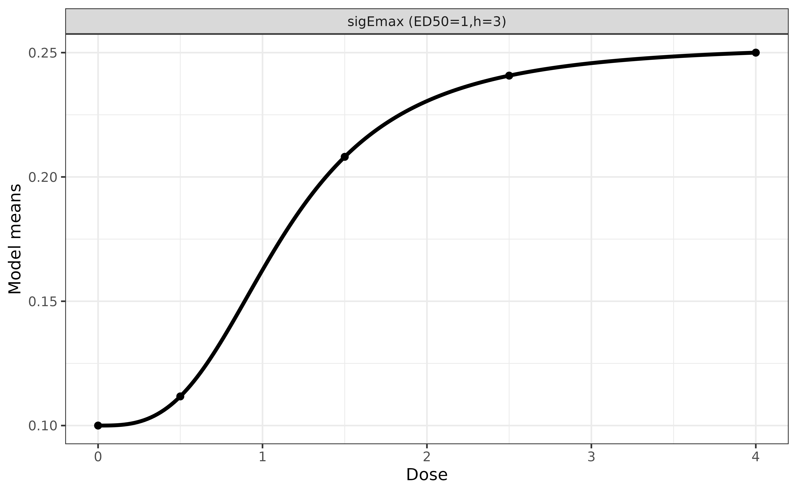
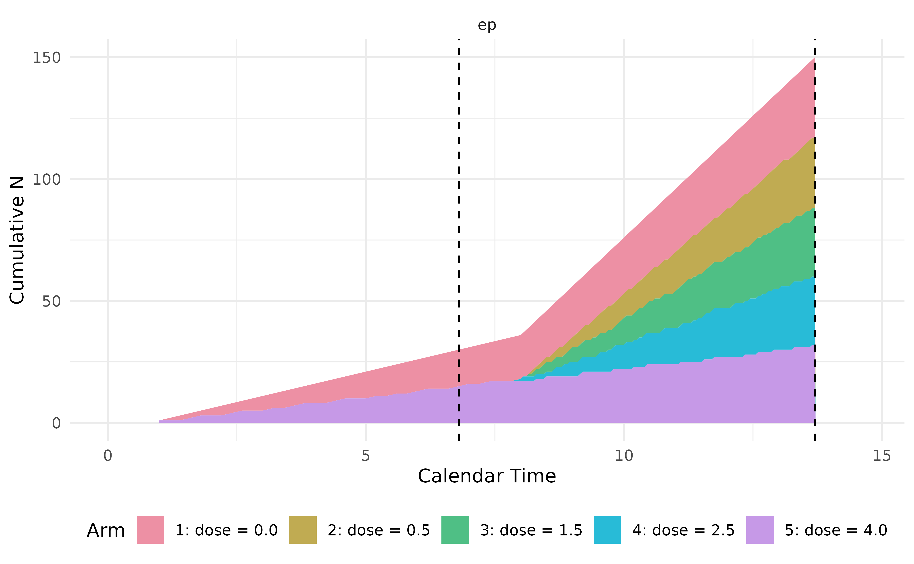

# Dose-Ranging Study

In this vignette, we implement simulation for a dose-ranging trial under
adaptive design. We start from a placebo arm and a treatment arm with
highest possible dose. At an interim, if we observe promising results,
we add arms with doses in between to inform decision at final analysis.

For the sake of simplicity, we assume a binary endpoint of interest. The
response rates at doses 0 (placebo), 0.5, 1.5, 2.5, 4 (highest dose) are
given by a `sigEmax` model below, where the response rate is assume to
be 10% in placebo, and 25% in arm of the highest dose (dose = 4). For
further background information, refer to
[vignette](https://cran.r-project.org/web/packages/DoseFinding/vignettes/binary_data.html)
of the `DoseFinding` package.

``` r
mods <- DoseFinding::Mods(sigEmax = rbind(c(1, 3)), 
                          placEff = log(.1/(1 - .1)), 
                          maxEff = log(.25/(1 - .25)) - log(.1/(1 - .1)),
                          doses = c(0, 0.5, 1.5, 2.5, 4))

DoseFinding::plotMods(mods, trafo = function(x) 1/(1+exp(-x)))
```



``` r

## response rates on curve
x <- DoseFinding::getResp(mods, doses = c(0, 0.5, 1.5, 2.5, 4))
1 / (1 + exp(-unclass(x)))
#>      sigEmax1
#> 0   0.1000000
#> 0.5 0.1117242
#> 1.5 0.2080893
#> 2.5 0.2407520
#> 4   0.2500000
#> attr(,"parList")
#> attr(,"parList")$sigEmax1
#>        e0      eMax      ed50         h 
#> -2.197225  1.115778  1.000000  3.000000
```

## Simulation Settings

In our simulation, we assume

- the response rates of binary endpoint as

| Dose              | 0    | 0.5  | 1.5  | 2.5  | 4    |
|-------------------|------|------|------|------|------|
| Response Rate (%) | 10.0 | 11.2 | 20.8 | 24.1 | 25.0 |

- readout time is 1 week.
- no dropout.
- starting with a placebo arm and a treatment arm of the highest dose (=
  4), with a 1:1 randomization ratio.
  - enroll 5 patients per week for 7 weeks.
- an interim is planed when we have collected 30 readouts in total from
  the two arms.
  - if z statistic of odds ratio is greater than 1
    - add three arms of dose 0.5, 1.5, and 2.5 to trial
    - enroll 20 patients per week with a randomization ratio 1:2:2:2:1,
      until in total 150 patients are enrolled in the trial
    - final analysis is performed when readouts are available for all
      enrolled patients.
  - otherwise, stop the trial.

## Define Placebo and High Dose Arms

``` r
ep <- endpoint(name = 'ep', type = 'non-tte', readout = c(ep = 1),
               generator = rbinom, size = 1, prob = 0.1)
pbo <- arm(name = 'dose = 0.0')
pbo$add_endpoints(ep)

ep <- endpoint(name = 'ep', type = 'non-tte', readout = c(ep = 1),
               generator = rbinom, size = 1, prob = 0.25)
trt4 <- arm(name = 'dose = 4.0')
trt4$add_endpoints(ep)
```

## Define a Trial

``` r
accrual_rate <- data.frame(end_time = c(7, Inf),
                           piecewise_rate = c(5, 20))

trial <- trial(name = '123', n_patients = 150, duration = 14,
               enroller = StaggeredRecruiter, accrual_rate = accrual_rate, 
               silent = TRUE)

trial$add_arms(sample_ratio = c(1, 1), pbo, trt4)
trial
#>  ⚕⚕ Trial Name:  123  
#>  ⚕⚕ Description:  123  
#>  ⚕⚕ # of Arms:  2  
#>  ⚕⚕ Registered Arms:  dose = 0.0, dose = 4.0  
#>  ⚕⚕ Sample Ratio:  1, 1  
#>  ⚕⚕ # of Patients:  150  
#>  ⚕⚕ Planned Duration:  14  
#>  ⚕⚕ Random Seed:  1960520344
```

## Define Milestones and Actions

Two milestones are triggered when 30 and 150 readouts are collected,
respectively. Note that the 30 readouts are from the placebo and the
highest dose arm, while the 150 readouts are from all five arms.

``` r
interim <- milestone(name = 'interim',
                     when = eventNumber(endpoint = 'ep', n = 30),
                     action = action_at_interim)

final <- milestone(name = 'final',
                   when = eventNumber(endpoint = 'ep', n = 150),
                   action = action_at_final)
```

In the action function `action_at_interim()`, we don’t actually
terminate the trial in simulation but always add dose arms. Instead, we
save the z statistic for summary later, e.g., computing the proportion
of early termination.

``` r
action_at_interim <- function(trial){

  ## get data snapshot
  locked_data <- trial$get_locked_data('interim')

  ## compare two arms
  ## Risk difference = response rate in high dose - response rate in placebo
  fit <- fitLogistic(ep ~ arm, placebo = 'dose = 0.0',
                     data = locked_data, alternative = 'greater',
                     scale = 'risk difference')

  ## for summary of early termination
  trial$save(value = fit$z, name = 'z_value')
  trial$save(value = ifelse(fit$z > 1.64, 'add dose arms', 'stop trial'), 
             name = 'interim_decision')

  ## create three dose arms
  ep <- endpoint(name = 'ep', type = 'non-tte', readout = c(ep = 1),
                 generator = rbinom, size = 1, prob = .112)
  trt1 <- arm(name = 'dose = 0.5')
  trt1$add_endpoints(ep)

  ep <- endpoint(name = 'ep', type = 'non-tte', readout = c(ep = 1),
                 generator = rbinom, size = 1, prob = .208)
  trt2 <- arm(name = 'dose = 1.5')
  trt2$add_endpoints(ep)

  ep <- endpoint(name = 'ep', type = 'non-tte', readout = c(ep = 1),
                 generator = rbinom, size = 1, prob = .241)
  trt3 <- arm(name = 'dose = 2.5')
  trt3$add_endpoints(ep)

  ## add three new arms to trial
  trial$add_arms(sample_ratio = c(2, 2, 2), trt1, trt2, trt3)
  
}
```

At final analysis, we analyze data from all five arms using MCPMod. It
calls a helper function `go_nogo()` which can be found in the Appendix
below.

``` r
action_at_final <- function(trial){

  locked_data <- trial$get_locked_data('final')

  trial$save(value = go_nogo(locked_data), name = 'decision')

}
```

## Execute a Trial

After registering the two milestones with a listener, we simulate a
single trial using `controller$run()`. We can see that more patients are
randomized to the three newly added arms after interim, reflecting the
new randomization ratio 1:2:2:2:1.

``` r
listener <- listener()
listener$add_milestones(interim, final)

controller <- controller(trial, listener)
controller$run(n = 1, plot_event = TRUE)
```



In this trial, the z statistic at interim is relatively low (1.33), thus
is early terminated even if in simulation we keep going with three newly
added dose arms.

``` r
output <- controller$get_output()

output %>% 
  kable(escape = FALSE) %>% 
  kable_styling(bootstrap_options = "striped", 
                full_width = FALSE,
                position = "left") %>%
  scroll_box(width = "100%")
```

| trial |       seed | milestone_time\_\<interim\> | n_events\_\<interim\>\_\<patient_id\> | n_events\_\<interim\>\_\<ep\> | n_events\_\<interim\>\_\<arms\> |  z_value | interim_decision | milestone_time\_\<final\> | n_events\_\<final\>\_\<patient_id\> | n_events\_\<final\>\_\<ep\> | n_events\_\<final\>\_\<arms\> | decision | error_message |
|:------|-----------:|----------------------------:|--------------------------------------:|------------------------------:|:--------------------------------|---------:|:-----------------|--------------------------:|------------------------------------:|----------------------------:|:------------------------------|:---------|:--------------|
| 123   | 1960520344 |                         6.8 |                                    35 |                            30 | c(18, 15….                      | 1.332786 | stop trial       |                      13.7 |                                 150 |                         150 | c(33, 33….                    | no-go    |               |

We can call `controller$run(n = 10)` to simulate additional trials. in
the function `action_at_final()`, the go/no-go decision (`decision` in
output) is determined under the assumption that the dose has been
expanded, regardless of the interim evidence—this simplification is made
solely for the convenience of simulation. However, the overall
probability of a `"go"` should incorporate the interim
results—specifically, the trial must not be stopped at interim, and the
function `go_nogo()` must return `"go"` at the final analysis.

``` r
## important: reset before calling run() again
controller$reset()
controller$run(n = 6, plot_event = FALSE, silent = TRUE)
controller$get_output() %>% 
  kable(escape = FALSE) %>% 
  kable_styling(bootstrap_options = "striped", 
                full_width = FALSE,
                position = "left") %>%
  scroll_box(width = "100%")
```

| trial |       seed | milestone_time\_\<interim\> | n_events\_\<interim\>\_\<patient_id\> | n_events\_\<interim\>\_\<ep\> | n_events\_\<interim\>\_\<arms\> |   z_value | interim_decision | milestone_time\_\<final\> | n_events\_\<final\>\_\<patient_id\> | n_events\_\<final\>\_\<ep\> | n_events\_\<final\>\_\<arms\> | decision | error_message |
|:------|-----------:|----------------------------:|--------------------------------------:|------------------------------:|:--------------------------------|----------:|:-----------------|--------------------------:|------------------------------------:|----------------------------:|:------------------------------|:---------|:--------------|
| 123   | 2006631926 |                         6.8 |                                    35 |                            30 | c(17, 15….                      |  1.035098 | stop trial       |                      13.7 |                                 150 |                         150 | c(32, 32….                    | go       |               |
| 123   |  447300730 |                         6.8 |                                    35 |                            30 | c(17, 15….                      | -1.519109 | stop trial       |                      13.7 |                                 150 |                         150 | c(32, 32….                    | no-go    |               |
| 123   | 1544385735 |                         6.8 |                                    35 |                            30 | c(17, 15….                      |  1.095446 | stop trial       |                      13.7 |                                 150 |                         150 | c(32, 32….                    | no-go    |               |
| 123   | 2131809493 |                         6.8 |                                    35 |                            30 | c(18, 15….                      |  1.936492 | add dose arms    |                      13.7 |                                 150 |                         150 | c(33, 33….                    | no-go    |               |
| 123   |  799237881 |                         6.8 |                                    35 |                            30 | c(17, 15….                      |  1.095446 | stop trial       |                      13.7 |                                 150 |                         150 | c(32, 32….                    | no-go    |               |
| 123   | 1359695008 |                         6.8 |                                    35 |                            30 | c(17, 15….                      |  1.525644 | stop trial       |                      13.7 |                                 150 |                         150 | c(32, 32….                    | no-go    |               |

## Appendix: Code of Helper Function

For completeness, the full code of the helper functions `go_nogo()` is
included below, which informs go/no-go decision at the end of the trial.

``` r
go_nogo <- function(data){

  ## candidate models for MCPMod
  doses <- c(0, 0.5, 1.5, 2.5, 4)
  candidates <- Mods(emax = c(.25, 1),
                     sigEmax = rbind(c(1, 3), c(2.5, 4)),
                     betaMod = c(1.1, 1.1),
                     placEff = log(.1/(1 - .1)),
                     maxEff = log(.25/(1 - .25)) - log(.1/(1 - .1)),
                     doses = doses)

  fit <- glm(ep ~ factor(arm) + 0, data = data, family = binomial)
  mu_hat <- coef(fit)
  S_hat <- vcov(fit)

  ## multiple contrast test
  test <- DoseFinding::MCTtest(dose = doses,
                               mu_hat, S = S_hat,
                               models = candidates, type = "general")

  ## model averaging
  model <- DoseFinding::maFitMod(dose = doses,
                                 mu_hat, S = S_hat,
                                 models = c("emax", "sigEmax", "betaMod"))
  
  ## predict response rate per dose
  prd <- predict(model, summaryFct = median, doseSeq = doses)
  
  ## convert to scale of probability
  prd_rate <- 1 / (1 + exp(-prd))

  ## go/no-go rule: MCP test p-value < 0.05 and estimated effect > 10%
  ifelse(min(attr(test$tStat, 'pVal')) < .05 &
           max(prd_rate - prd_rate[1]) > .1, 'go', 'no-go')

}
```
