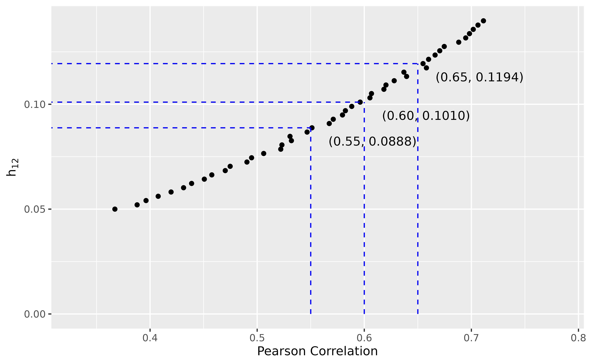

# Simulate Correlated Progression-Free Survival and Overall Survival as Endpoints Under Illness-Death Model

Progression-free survival (PFS) and overall survival (OS) are commonly
used as confirmatory endpoints in clinical trials. These two endpoints
are typically highly correlated, and it is always the case that PFS
$`\leq`$ OS. A reliable algorithm for simulating both PFS and OS is
therefore of great interest.

Several methods have been proposed to achieve this, but many rely on
latent variables or copula-based approaches, making it difficult to
interpret and specify model parameters in practical settings. In this
vignette, we do not aim to provide a comprehensive review of existing
methods. Instead, we focus on a three-state illness-death model
consisting of the following states: initial (0), progression (1), and
death (2). For more details, refer to [Meller, Beyersmann, and Rufibach
(2019)](https://onlinelibrary.wiley.com/doi/abs/10.1002/sim.8295).


We consider the simplest case of the illness-death model, where all
transition hazards $`h(t)`$ are constant over time. A data generator of
this model is implemented in
[`TrialSimulator::CorrelatedPfsAndOs3()`](https://zhangh12.github.io/TrialSimulator/reference/CorrelatedPfsAndOs3.md),
which can be used to define endpoints in
[`TrialSimulator::endpoint()`](https://zhangh12.github.io/TrialSimulator/reference/endpoint.md).

Marginally, the survival functions of PFS and OS are given by

``` math
\Pr(\mbox{PFS} > t) = \exp\{-(h_{01} + h_{02})t\}
```

and

``` math
\Pr(\mbox{OS} > t)  = \exp\{-(h_{01} + h_{02})t\} + \frac{h_{01}}{h_{12}-h_{01}-h_{02}}\exp\{-(h_{01} + h_{02})t\} - \exp\{-h_{12}t\}
```

Thus, PFS follows an exponential distribution with rate
$`h_{01} + h_{02}`$, which is also referred to as the all-cause hazard.
Given the transition hazards $`h_{01}, h_{02}, h_{12}`$, a patient’s
trajectory can be simulated using the following algorithm:

- **Step 1**. Generate the time to progression $`t_{01}`$ from an
  exponential distribution with rate $`h_{01} + h_{02}`$.

- **Step 2**. Draw a Bernoulli sample with success probability
  $`\frac{h_{02}}{h_{01} + h_{02}}`$. If successful, the patient dies
  immediately, i.e., time to death $`t_{02} = t_{01}`$, and the
  simulation ends. Otherwise, proceed to Step 3.

- **Step 3**. Generate the time from progression to death $`t_{12}`$
  from an exponential distribution with rate $`h_{12}`$. Then, time to
  death $`t_{02} = t_{01} + t_{12}`$, and the simulation ends.

## Reparameterization

Although statistical methods exist for estimating transition hazards
when data are available (e.g., the R package `simIDM`), in simulation
studies for trial planning, it is common to specify these hazard
parameters based on limited information. A more intuitive way to define
PFS and OS is through their medians and correlation coefficient. In this
section, we describe a reparameterization strategy that maps the medians
and correlation to the transition hazards.

Let $`m_1`$ and $`m_2`$ denote the medians of PFS and OS, respectively.
Then we have

``` math
h_{01} + h_{02} = \frac{\log(2)}{m_1} \tag{1}
```

and

``` math
\frac{1}{2} = \exp\{-(h_{01} + h_{02})m_2\} + \frac{h_{01}}{h_{12}-h_{01}-h_{02}}\exp\{-(h_{01} + h_{02})m_2\} - \exp\{-h_{12}m_2\}
```
Through algebraic manipulation, we obtain

``` math
h_{01} = \frac{(\frac{1}{2} - \exp\{-\log(2) \frac{m_2}{m_1}\}) (h_{12} - \log(2) \frac{1}{m_1})}{
      (\exp\{-\log(2) \frac{m_2}{m_1}\} - \exp\{-h_{12} m_2\})}
      \tag{2}
```

This implies that, for given medians $`m_1`$ and $`m_2`$, we can perform
a grid search over values of $`h_{12}`$. For each candidate value, we
compute $`h_{01}`$ and $`h_{02}`$ using equations (1) and (2),
respectively. Then, we simulate a large dataset using
[`TrialSimulator::CorrelatedPfsAndOs3()`](https://zhangh12.github.io/TrialSimulator/reference/CorrelatedPfsAndOs3.md)
and calculate the Pearson correlation between PFS and OS. We select the
value of $`h_{12}`$ (and the corresponding $`h_{01}, h_{02}`$) that
yields the desired correlation.

This reparameterization of the three-state illness-death model enables
us to specify correlated PFS and OS based on their medians and
correlation, which is more interpretable and practical in clinical trial
design. The `TrialSimulator` package provides a dedicated function,
`solveThreeStateModel`, to facilitate this process.

## Example

Suppose we aim to simulate PFS with a median of 5 and OS with a median
of 12, targeting a correlation of 0.6 between them.

``` r

pars <- solveThreeStateModel(median_pfs = 5, median_os = 12, 
                             corr = seq(.55, .65, by = .05), 
                             h12 = seq(.05, .15, length.out = 50))
plot(pars)
#>   corr       h01        h02        h12       error
#> 1 0.55 0.0997785 0.03885093 0.08877551 0.001158721
#> 2 0.60 0.1080742 0.03055522 0.10102041 0.003826014
#> 3 0.65 0.1214222 0.01720720 0.11938776 0.004866790
#> Warning: Removed 3 rows containing missing values or values outside the scale range
#> (`geom_segment()`).
```



The result suggests that using $`h_{01} = 0.11`$, $`h_{02} = 0.03`$, and
$`h_{12} = 0.10`$ may achieve the desired specifications. To verify
this, we simulate PFS and OS data using

``` r

pfs_and_os <- endpoint(name = c('pfs', 'os'), 
                       type = c('tte', 'tte'), 
                       generator = CorrelatedPfsAndOs3, 
                       h01 = .11, h02 = .03, h12 = .10, 
                       pfs_name = 'pfs', os_name = 'os')
pfs_and_os
```

CjwhRE9DVFlQRSBodG1sPgo8aHRtbD4KPGhlYWQ+CiAgICA8bWV0YSBjaGFyc2V0PSJVVEYtOCI+CiAgICA8dGl0bGU+RW5kcG9pbnRzICgyKTwvdGl0bGU+CiAgICA8c3R5bGU+CiAgICAgICAgYm9keSB7CiAgICAgICAgICAgIGZvbnQtZmFtaWx5OiBBcmlhbCwgc2Fucy1zZXJpZjsKICAgICAgICAgICAgbWFyZ2luOiAyMHB4OwogICAgICAgICAgICBiYWNrZ3JvdW5kLWNvbG9yOiB3aGl0ZTsKICAgICAgICAgICAgZGlzcGxheTogZmxleDsKICAgICAgICAgICAgZmxleC1kaXJlY3Rpb246IGNvbHVtbjsKICAgICAgICAgICAgYWxpZ24taXRlbXM6IGNlbnRlcjsKICAgICAgICB9CiAgICAgICAgaDEgewogICAgICAgICAgICBjb2xvcjogYmxhY2s7CiAgICAgICAgICAgIHRleHQtYWxpZ246IGNlbnRlcjsKICAgICAgICAgICAgbWFyZ2luLWJvdHRvbTogMjBweDsKICAgICAgICAgICAgZm9udC1zaXplOiAyMHB4OwogICAgICAgIH0KICAgICAgICAuc3VidGl0bGUgewogICAgICAgICAgICB0ZXh0LWFsaWduOiBjZW50ZXI7CiAgICAgICAgICAgIGNvbG9yOiAjNjY2OwogICAgICAgICAgICBtYXJnaW4tYm90dG9tOiAyMHB4OwogICAgICAgICAgICBmb250LXNpemU6IDE2cHg7CiAgICAgICAgfQogICAgICAgIHRhYmxlIHsKICAgICAgICAgICAgYm9yZGVyLWNvbGxhcHNlOiBjb2xsYXBzZTsKICAgICAgICAgICAgZm9udC1zaXplOiAxNHB4OwogICAgICAgICAgICBib3JkZXI6IDFweCBzb2xpZCAjOTk5OwogICAgICAgICAgICB3aWR0aDogYXV0bzsKICAgICAgICAgICAgbWFyZ2luOiAwIGF1dG87CiAgICAgICAgfQogICAgICAgIHRoIHsKICAgICAgICAgICAgYmFja2dyb3VuZC1jb2xvcjogI2YwZjBmMDsKICAgICAgICAgICAgY29sb3I6IGJsYWNrOwogICAgICAgICAgICBwYWRkaW5nOiAxMHB4OwogICAgICAgICAgICB0ZXh0LWFsaWduOiBsZWZ0OwogICAgICAgICAgICBmb250LXdlaWdodDogbm9ybWFsOwogICAgICAgICAgICBib3JkZXI6IDFweCBzb2xpZCAjOTk5OwogICAgICAgICAgICB3aGl0ZS1zcGFjZTogbm93cmFwOwogICAgICAgICAgICBmb250LXNpemU6IDE0cHg7CiAgICAgICAgfQogICAgICAgIHRkIHsKICAgICAgICAgICAgcGFkZGluZzogMTBweDsKICAgICAgICAgICAgYm9yZGVyOiAxcHggc29saWQgIzk5OTsKICAgICAgICAgICAgdmVydGljYWwtYWxpZ246IHRvcDsKICAgICAgICAgICAgbGluZS1oZWlnaHQ6IDEuNDsKICAgICAgICAgICAgZm9udC1zaXplOiAxNHB4OwogICAgICAgIH0KICAgICAgICAubm8tY29sIHsKICAgICAgICAgICAgdGV4dC1hbGlnbjogY2VudGVyOwogICAgICAgICAgICB3aGl0ZS1zcGFjZTogbm93cmFwOwogICAgICAgIH0KICAgICAgICAudmFyaWFibGUtY29sIHsKICAgICAgICAgICAgd2hpdGUtc3BhY2U6IG5vd3JhcDsKICAgICAgICB9CiAgICAgICAgLnN0YXRzLWNvbCB7CiAgICAgICAgfQogICAgICAgIC5mcmVxcy1jb2wgewogICAgICAgICAgICBsaW5lLWhlaWdodDogMjBweDsKICAgICAgICB9CiAgICAgICAgLmdyYXBoLWNvbCB7CiAgICAgICAgICAgIHRleHQtYWxpZ246IGNlbnRlcjsKICAgICAgICAgICAgd2hpdGUtc3BhY2U6IG5vd3JhcDsKICAgICAgICAgICAgdmVydGljYWwtYWxpZ246IHRvcDsKICAgICAgICB9CiAgICAgICAgaW1nIHsKICAgICAgICAgICAgZGlzcGxheTogYmxvY2s7CiAgICAgICAgICAgIG1hcmdpbjogMCBhdXRvOwogICAgICAgICAgICB2ZXJ0aWNhbC1hbGlnbjogdG9wOwogICAgICAgIH0KICAgIDwvc3R5bGU+CjwvaGVhZD4KPGJvZHk+CiAgICA8aDE+RW5kcG9pbnRzICgyKTwvaDE+CiAgICA8ZGl2IGNsYXNzPSJzdWJ0aXRsZSIgc3R5bGU9InRleHQtYWxpZ246IGxlZnQ7Ij4KICAgICAgICBwZnMsIG9zPGJyPgogICAgPC9kaXY+CgogICAgPHRhYmxlPgogICAgICAgIDx0aGVhZD4KICAgICAgICAgICAgPHRyPgogICAgICAgICAgICAgICAgPHRoIGNsYXNzPSJuby1jb2wiPk5vPC90aD4KICAgICAgICAgICAgICAgIDx0aCBjbGFzcz0idmFyaWFibGUtY29sIj5WYXJpYWJsZTwvdGg+CiAgICAgICAgICAgICAgICA8dGggY2xhc3M9InN0YXRzLWNvbCI+U3RhdHMgLyBGcmVxczwvdGg+CiAgICAgICAgICAgICAgICA8dGggY2xhc3M9ImdyYXBoLWNvbCI+R3JhcGg8L3RoPgogICAgICAgICAgICA8L3RyPgogICAgICAgIDwvdGhlYWQ+CiAgICAgICAgPHRib2R5PgogICAgICAgICAgICA8dHI+CiAgICAgICAgICAgICAgICA8dGQgY2xhc3M9Im5vLWNvbCI+MTwvdGQ+CiAgICAgICAgICAgICAgICA8dGQgY2xhc3M9InZhcmlhYmxlLWNvbCI+cGZzPGJyPlt0aW1lLXRvLWV2ZW50XTwvdGQ+CiAgICAgICAgICAgICAgICA8dGQgY2xhc3M9InN0YXRzLWNvbCI+TWVkaWFuIHRpbWU6IDU8YnI+RXZlbnRzOiAxMDAwMDxicj5NaXNzaW5nOiAwICgwJSk8L3RkPgogICAgICAgICAgICAgICAgPHRkIGNsYXNzPSJncmFwaC1jb2wiPjxpbWcgc3JjPSJkYXRhOmltYWdlL3BuZztiYXNlNjQsaVZCT1J3MEtHZ29BQUFBTlNVaEVVZ0FBQUhnQUFBQlFDQU1BQUFEbFJVRzdBQUFDL1ZCTVZFVUFBQUFIQndjSUNBZ0pDUWtLQ2dvTEN3c01EQXdPRGc0UER3OFJFUkVTRWhJVEV4TVVGQlFWRlJVV0ZoWVhGeGNZR0JnWkdSa2FHaG9iR3hzY0hCd2RIUjBnSUNBaElTRWlJaUlqSXlNa0pDUWxKU1VuSnljcEtTa3FLaW91TGk0dkx5OHhNVEV6TXpNME5EUTFOVFUzTnpjNE9EZzZPam84UER3OVBUMCtQajQvUHo5QVFFQkNRa0pEUTBORVJFUkdSa1pJU0VoSlNVbEtTa3BMUzB0TVRFeE5UVTFRVUZCUlVWRlNVbEpWVlZWWVdGaFpXVmxiVzF0Y1hGeGRYVjFnWUdCalkyTmtaR1JsWldWbVptWm5aMmRvYUdocGFXbHJhMnR0YlcxdmIyOXljbkp6YzNOMmRuWjNkM2Q1ZVhsNmVucDdlM3Q4Zkh5QWdJQ0JnWUdDZ29LRGc0T0ZuTmlHaG9hSGg0ZUlpSWlKaVltS2lhT0tpb3FMaTR1TWpJeU5qWTJQajQrUWtKQ1NpblNXbHBhWGw1ZVptWm1abmEyYm01dWNuSnllbnA2Z29LQ2hvYUdpb3FLam82T2tvYlNtcHFhbm5MdW5wNmVvbXJxb3FLaXBxYW1xbTdxcXFxcXJxNnVycmE2dHBidXVxc0N1cnE2dnI2K3Zzc3V2dGMyeHNiR3lzckt6czdPMHRMUzF0cmEyc01XMnRyYTNwYlMzdDdlM3Z0UzRwS0s0c3NlNHVMaTR1Ym00dTlDNXVicTV2OVc3dTd1OG9adTh2THk5dmIyOXllQzkwT2krcGJPK3FiTy9wTEsvdjcvQXJMWEF3TURBMCtyQndjSEMrZi9EdzhQRXJaZkV4TVRHc2E3R3hzYkl5TWpKeWNuS3lzckx5OHZMME0zTXpNek5zNjNOemMzTjBzN096czdQdUxUUHo4L1F6YzNSdXJmUisvL1MwdExVMU5UVjFkWFcxdGJXMmZIWDE5Zll0Ny9ZMk5qWi9QL2IyOXZiL1AvZDNkM2YvUC9nNE9EZy9QL2g0ZUhpemREaTR1TGo0K1BrNU9UbDVlWG16cnptK3ZMbS9mL241K2ZuL2YvbzBiL281ZWpvNk9qby9mL3A2ZW5yNit2czNPTHM2dXpzN096cy92L3Q2dGp1N3U3dS92L3Y3Ky92L3YvdzhQRHcrZi95K3YveS8vL3o2dXp6OC9QMDlQVDArLy8xMTdEMTlmWDE5djcyOXZiMzkvZjQrUGo1K2ZuNS8vLzY4dTc2K3ZyNi8vLzcrL3Y3Ly8vODl2RDgvUHo5NXVQOS9mMys2YjcrN3V6Ky92Ny8rTzcvK2ZILytmai8rL1QvLy9mLy8vOGU2czBjQUFBQUNYQklXWE1BQUE3REFBQU93d0hIYjZoa0FBQURRMGxFUVZSb2dlM1llVnlMY1J3SDhCRWRscEtreVpFY01ZdENpYm1KcE1zdFJTbVpJM0ptanB3bG9SQzVjaC9KZmVkbUNKVXpSKzR6WnlFNVJzajNaYTMydE4vVHNpMzdQYjkvOXYxbnoyZlA4M3U5OS9wdHY5L3o3TXNDUXNYU3dvekJlZW12eU1DVGRxdzhSQVJPalZqK1hCYUN2VHdBVWhLWWdRRitQSlFGLzI3NkFCSE5tSUcvajFsMGswb3BsUUhTakptQi83eVZTL2t3bUlzWWdaRWtoZmtoaEdCdmQwTHdXaTRoT0ZQM1BSa1lHbXdrQkx0N013RXZIVGIxRkEyZWJjOEV2R3ZLakd1eUlJcVViaDRQMkRrTXdBRGZyc2dDMzFKSCttcTltUUY0VGZUQzgxUXFtR3J3WW1BbHMvYUZ6NzlIaDdkYk1RQWpxUkFXRzkwaUEwUHJVWVRnVUFkQzhFdjJFekl3OE1jU2dvUGJZSWNQYkptSlB2cEk2N1poTm01NDA4QnBaNHJEd0l2RkRjdHZtVno5TXJKRFh4ZmM4TUhvSmRUTzllYW9pZXd3eVJUempZSzFLbnp1V1NvVlRUWHc1bUNHa1NRSGoyNUJDTTZxbUV3R0JqZTg5OGFTNFl0R21XUmdjQnhLQ0k2M0VPT0V2OXcvOWtFeEROenhPT0hYUS9vL0xnR09yZkVWSXd3LzcxQmJwcXVETG5LU094a2pmSDN4dXMreUVDY3dSRTZHV2VYaWd5ZnNXVjNVZkVHbkduTHI0dnVXV2I5dVBDMUtOQmppTExLd3dVaWl3K0RZbHhDY3hENU5Cb1lBYTB4TFNobWNhek9BREF6bmpQSDhkV1I5ZlBhN3BDMnpvR2FaWGNJQ2oxc3diOE0vWVJoYzZ4RU8rTUxsRTFRcllycFBCVVhYZE9lOXd3RG5wYitnbXFqOTJ1a3B1a2JjdmxHRzVtR2tYNjF3cWlXeWMyMk5MMmRXYXNTS1Q4cGdnQkhHUVJwZXowcVhVMkh0YnNoTElnS0QySS9kVTVPL2JwVmh5V05uUjRNQXpYVTUxWUFCVHRxYmVPelYwTE9CV2pCQW9uczFNeGVoSnFaY1RWaFNod2MxMWJQekRFbjh6eTZKd3M2ZXNzb0k3ZDJ5Wm5sam0wNCt3Y3VPM3kzZDNDT2R2YlN0bGRRWW1od2I2TmFXVjkyQVZjN2NzcDZ0UGI5REY0OCtmZ0tCUUNnVVJzVklhdjFPZW9sRW9xc1VMTjhSYUY2MVNtaytmSVpvZjBKTW1IQmtvSGN2VnllbnpudyszODVXVXR3NjlPSndPRTBvR0pscUJndHRvdWFYdndFSEtYTWROSFAwVGRGc29uVEFSRVZ3c1hlQ1dvbVFPbElXemFMR3c5SHNTeHVRcUVNZkVLWVNIT1dKNXB6NnRBdWM0OUVjMlFQTjJmUUJYYmVwQkROVVdsZ0xhMkV0cklWVnJyK1dvOEN4VFUyckNnQUFBQUJKUlU1RXJrSmdnZz09IiBhbHQ9IktNIGN1cnZlIj48L3RkPgogICAgICAgICAgICA8L3RyPgogICAgICAgICAgICA8dHI+CiAgICAgICAgICAgICAgICA8dGQgY2xhc3M9Im5vLWNvbCI+MjwvdGQ+CiAgICAgICAgICAgICAgICA8dGQgY2xhc3M9InZhcmlhYmxlLWNvbCI+b3M8YnI+W3RpbWUtdG8tZXZlbnRdPC90ZD4KICAgICAgICAgICAgICAgIDx0ZCBjbGFzcz0ic3RhdHMtY29sIj5NZWRpYW4gdGltZTogMTIuMDk8YnI+RXZlbnRzOiAxMDAwMDxicj5NaXNzaW5nOiAwICgwJSk8L3RkPgogICAgICAgICAgICAgICAgPHRkIGNsYXNzPSJncmFwaC1jb2wiPjxpbWcgc3JjPSJkYXRhOmltYWdlL3BuZztiYXNlNjQsaVZCT1J3MEtHZ29BQUFBTlNVaEVVZ0FBQUhnQUFBQlFDQU1BQUFEbFJVRzdBQUFDOTFCTVZFVUhCd2NKQ1FrS0Nnb0xDd3NNREF3TkRRME9EZzRQRHc4UkVSRVNFaElURXhNVUZCUVdGaFlYRnhjWUdCZ1pHUmthR2hvYkd4c2NIQndkSFIwZUhoNGZIeDhnSUNBaElTRWlJaUlqSXlNa0pDUWxKU1VuSnljcEtTa3FLaW9yS3lzc0xDd3RMUzB1TGk0dkx5OHdNREF4TVRFeU1qSXpNek0wTkRRNU9UazZPam84UER3OVBUMCtQajVBUUVCQlFVRkNRa0pEUTBORVJFUkdSa1pIUjBkS1NrcE1URXhOVFUxUFQwOVJVVkZTVWxKVVZGUlZWVlZZV0ZoY1hGeGRYVjFmWDE5Z1lHQmhZV0ZpWW1KalkyTmxaV1ZtWm1ab2FHaHJhMnR0YlcxeGNYRnljbkowZEhSMWRYVjNkM2Q0ZUhoNWVYbDlmWDErZm41L2YzK0JnWUdDZ29LRGc0T0VoSVNGaFlXRm5OaUdob2FJaUlpSmlZbUtpYU9LaW9xTWpJeU5qWTJPam82UGo0K1FrSkNSa1pHU2luU1dscGFabVptWm5hMmJtNXVjbkp5ZW5wNmdvS0Nob2FHam82T2tvYlNrcEtTbXBxYW5uTHVucDZlb21ycXFtN3FxcXFxcnJhNnRwYnV0cmEydXFzQ3ZyNit2c3N1dnRjMndzTEN6czdPMHRMUzF0cmEyc01XMnRyYTNwYlMzdDdlM3Z0UzRwS0s0c3NlNHVMaTR1Ym00dTlDNXVicTV2OVc2dXJxN3U3dThvWnU4dkx5OXZiMjl5ZUM5ME9pK3BiTytxYk8vcExLL3Y3L0FyTFhBd01EQTArckJ3Y0hDd3NMQytmL0R3OFBFclpmRnhjWEdzYTdHeHNiSHg4Zkl5TWpKeWNuTHk4dkwwTTNNek16TnM2M056YzNOMHM3UHVMVFF6YzNRME5EUnVyZlIwZEhSKy8vUzB0TFQwOVBVMU5UVzF0YlcyZkhYMTlmWXQ3L1oyZG5aL1AvYjI5dmIvUC9jM056ZDNkM2UzdDdmMzkvZi9QL2cvUC9oNGVIaXpkRGk0dUxrNU9UbDVlWG16cnptNXVibSt2TG0vZi9uNStmbi9mL28wYi9vNWVqbzZPam8vZi9yNit2czNPTHM2dXpzN096cy92L3Q2dGp0N2UzdTd1N3Uvdi92Nysvdi92L3c4UER3K2YveDhmSHkrdi95Ly8vejZ1ejA5UFQwKy8vMTE3RDE5ZlgxOXY3NCtQajUvLy82OHU3Nit2cjYvLy83Ky92Ny8vLzg5dkQ4L1B6OTV1UDkvZjMrNmI3Kzd1eisvdjcvK083LytmSC8rZmovKy9ULy8vZi8vLzk4Q29DNUFBQUFDWEJJV1hNQUFBN0RBQUFPd3dISGI2aGtBQUFESGtsRVFWUm9nZTNZYVZSTVlSZ0g4Skdsa2lsazZtb2hXVUpFV1FvWlMvYVNwWWhCS0VTU0piSkhzbWJmMTJRTENka0tTV05YV1VQMmZWOWp4Q0RQQjZNeGQrYTljMmVham5udisyWCtIK2JjLzl3NzV6Zm5QWGZlTS9maEFhSHdEREJuY0VIdUt6THdoTjJyRHhHQnMySldQbGVVY0pFdlFPWk9ibUNBN3c4VUphaVRNY0F1ZTI3Z2I2TVgzcUJiWm5uWmkrTnlUdURmYjFWYUlSemFraE1ZYVlYdzA3TDN5Y0FnRENVRXoyaEFDTTZyY0pvTURKMERDY0Z4ZFRpQWx3MmZkSUlKU3poWWE5NmVpZE91S29wNERsOSs0TjBIUHd6dzliS2llRHFXa0I4azFNUVByNCtkZjVadS81WWFwTlFSN1BDKzZMbDMxR0R3OThFT0k0MkdNd1NFWUxBL1NBanUyWjBRbkVKSnljQlFLNEVRSE9DTEdkNi9iVHJqcjQ4OEtiYVk0UzBEcHB4a2c2RnFJbDVZZGN1c1o2eXk4djU0NzJ2ZWdkakY5TTcxSnRWQ2VTYlZCaSs4Sm5yV0dicXBMalU0N01BS0l3MkJSVmp2YXkxd3NoMGhHQnh3UGtWcGd3ZTJJd1RmeHZsSW9RMkdOb014d2wvdUhuMnZDVTRTNU9HRFh3L3QrMGdUREc2ajhNSHc0eGE5WlhvM0xZV2UzV1Fud1FaZlc3VHhzNktzQ3pGam5IYU93Z2FQMzd0V09YeGhMalZFTk1RRy83eitSTm5VWUlsTkhDNFlhV293akdoTUNQNUl4Wk9CWVl3VG50OXlrYkRVWlJBWkdETE0wckRBSDU3OTByaGx5ak9rZmo0T2VOeTgyWnUxd3hLWHJqamc4NWVPMDZPSXFmMU4yYTY1UjJFWWZQRUtjbC9RUTlUZXdqS3NGNldYMC84MmdzNnJXWmRhbHBtQ0hMM0RXVEdyUGhVSlE0L2FWL1FOSTAwakxPMWxmWXdJREJET2p5QURRN0t0NTBVaU1MenpNL043U0FJR09PVmwybjZKbnJheFlzRUEyWUUxK0czSFp1c0RacDNzYVV0NmNET1R5aDVkUnNhZmUvbGZzT3BrTDJlN3VVNGZ5aytMREd4VjE5S290SFYxZDY5dS9ZYUZoRVV1bFNVK2tUMkh4Y3JRMndFeUVXaGlWYkZZMy9xeE9Da3FWT1Ric1VQckZtNnlPRHV4cHhxbGpDc05JMHZOWWRBaDZ0OEVtVkJJQkNYUlRobFpvZDNFQXUxOFU3UlhzbUtGMWQ0SmF5NUdzc0VTN1dMenJXaDNEMGE3dnhEdE1WVjBneGN3cGowM0d6RXVjR1U4dlBxc1FQdmtBTFJmOE5BTjVpZ0cyQUFiWUFOc2dIWE9IMG1TZk5PTkJQcGJBQUFBQUVsRlRrU3VRbUNDIiBhbHQ9IktNIGN1cnZlIj48L3RkPgogICAgICAgICAgICA8L3RyPgogICAgICAgICAgICA8dHI+CiAgICAgICAgICAgICAgICA8dGQgY2xhc3M9Im5vLWNvbCI+MzwvdGQ+CiAgICAgICAgICAgICAgICA8dGQgY2xhc3M9InZhcmlhYmxlLWNvbCI+cGZzX2V2ZW50PGJyPltldmVudCBpbmRpY2F0b3JdPC90ZD4KICAgICAgICAgICAgICAgIDx0ZCBjbGFzcz0ic3RhdHMtY29sIj4xOiAxMDAwMCAoMTAwJSk8YnI+TWlzc2luZzogMCAoMCUpPC90ZD4KICAgICAgICAgICAgICAgIDx0ZCBjbGFzcz0iZ3JhcGgtY29sIj48aW1nIHNyYz0iZGF0YTppbWFnZS9wbmc7YmFzZTY0LGlWQk9SdzBLR2dvQUFBQU5TVWhFVWdBQUFIZ0FBQUFvQ0FNQUFBQUNOTTRYQUFBQUxWQk1WRVdabVptb3FLaXJxNnV0cmEyd3NMQzJ0cmE1dWJtL3Y3L0l5TWpOemMzVDA5UGYzOS9sNWVYcjYrdi8vLy9UK3NRK0FBQUFDWEJJV1hNQUFBN0RBQUFPd3dISGI2aGtBQUFBU1VsRVFWUlloZTNXdVFHQU1CREV3T1VIUDlkL3VTNURCRklEa3lvRmxSR292amVpUzFoWVdGaFkrSS93OWhLZG1RZFRzUFhCNFBsQmNMK0ZoWVdGaFlXRmFYZzhFTXl3VlF2a1VOcDBIYkVKbVFBQUFBQkpSVTVFcmtKZ2dnPT0iIGFsdD0iYmFycGxvdCIgc3R5bGU9ImhlaWdodDogYXV0bzsgd2lkdGg6IDEyMHB4OyI+PC90ZD4KICAgICAgICAgICAgPC90cj4KICAgICAgICAgICAgPHRyPgogICAgICAgICAgICAgICAgPHRkIGNsYXNzPSJuby1jb2wiPjQ8L3RkPgogICAgICAgICAgICAgICAgPHRkIGNsYXNzPSJ2YXJpYWJsZS1jb2wiPm9zX2V2ZW50PGJyPltldmVudCBpbmRpY2F0b3JdPC90ZD4KICAgICAgICAgICAgICAgIDx0ZCBjbGFzcz0ic3RhdHMtY29sIj4xOiAxMDAwMCAoMTAwJSk8YnI+TWlzc2luZzogMCAoMCUpPC90ZD4KICAgICAgICAgICAgICAgIDx0ZCBjbGFzcz0iZ3JhcGgtY29sIj48aW1nIHNyYz0iZGF0YTppbWFnZS9wbmc7YmFzZTY0LGlWQk9SdzBLR2dvQUFBQU5TVWhFVWdBQUFIZ0FBQUFvQ0FNQUFBQUNOTTRYQUFBQUxWQk1WRVdabVptb3FLaXJxNnV0cmEyd3NMQzJ0cmE1dWJtL3Y3L0l5TWpOemMzVDA5UGYzOS9sNWVYcjYrdi8vLy9UK3NRK0FBQUFDWEJJV1hNQUFBN0RBQUFPd3dISGI2aGtBQUFBU1VsRVFWUlloZTNXdVFHQU1CREV3T1VIUDlkL3VTNURCRklEa3lvRmxSR292amVpUzFoWVdGaFkrSS93OWhLZG1RZFRzUFhCNFBsQmNMK0ZoWVdGaFlXRmFYZzhFTXl3VlF2a1VOcDBIYkVKbVFBQUFBQkpSVTVFcmtKZ2dnPT0iIGFsdD0iYmFycGxvdCIgc3R5bGU9ImhlaWdodDogYXV0bzsgd2lkdGg6IDEyMHB4OyI+PC90ZD4KICAgICAgICAgICAgPC90cj4KICAgICAgICA8L3Rib2R5PgogICAgPC90YWJsZT4KPC9ib2R5Pgo8L2h0bWw+Cg==

If you are not familiar with the `TrialSimulator` framework, you can
generate PFS and OS directly by calling
[`CorrelatedPfsAndOs3()`](https://zhangh12.github.io/TrialSimulator/reference/CorrelatedPfsAndOs3.md):

``` r

dat <- CorrelatedPfsAndOs3(n = 1e6, h01 = .11, h02 = .03, h12 = .10)
head(dat, 2)
#>        pfs        os pfs_event os_event
#> 1 4.263915 12.997581         1        1
#> 2 4.257848  4.257848         1        1

## should be close to 0.6
with(dat, cor(pfs, os))
#> [1] 0.58961

## should be close to 5.0
with(dat, median(pfs))
#> [1] 4.965547

## should be close to 12.0
with(dat, median(os))
#> [1] 12.06319
with(dat, all(pfs <= os))
#> [1] TRUE
```

## Further Discussion

In this vignette, we demonstrate how to derive the transition hazards
from the medians of PFS and OS, along with their Pearson correlation
coefficient. It is important to note that the correlation is computed
based on data simulated from the specified hazard, and therefore can be
substituted by any other measure that is relevant to the simulation
objective.

For instance, one may simulate trial data for two treatment arms, each
defined by their own PFS and OS medians and $`h_{12}`$. Instead of using
the correlation between simulated PFS and OS times, one could compute
the correlation between the $`z`$-statistics from the respective
treatment comparisons of PFS and OS. This alternative approach may be
more appropriate in scenarios where the joint behavior of test
statistics, rather than raw survival times, is of primary interest—such
as in the context of multiple testing or endpoint selection.
