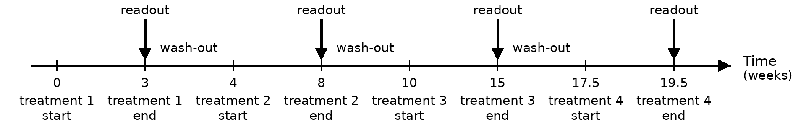

```{r, include = FALSE}
knitr::opts_chunk$set(
  collapse = TRUE,
  cache.path = 'cache/crossoverWashout/',
  comment = '#>',
  dpi = 300,
  out.width = '100%'
)
```

```{r setup, echo = FALSE, message = FALSE}
library(TrialSimulator)
library(mvtnorm)
library(dplyr)
library(kableExtra)
```

The `TrialSimulator` package can handle three types of crossover design.
This vignette focuses on a trial for studies on symptom reduction, e.g.,
for chronic conditions with short-lived and reversible treatment
effects. A crossover trial is a longitudinal design where participants
receive multiple treatments sequentially, acting as their own control if
the carry-over effect can be minimized by the use of untreated wash-out
period. We can use the similar idea in the
[vignette of longitudinal endpoints](https://cran.r-project.org/package=TrialSimulator/vignettes/defineLongitudinalEndpoints.html) to implement simulation, where endpoints at
the end of each treatment in the pre-determined and randomized sequence
are defined in function `endpoint()` with its argument `readout` is set.

## Simulation Settings

In simulation, we assume a balanced Latin square design of four arms

| Sequence | Treatment 1 | Treatment 2 | Treatment 3 | Treatment 4 |
|----------|-------------|-------------|-------------|-------------|
| ABCD     | A           | B           | C           | D           |
| BDAC     | B           | D           | A           | C           |
| CADB     | C           | A           | D           | B           |
| DCBA     | D           | C           | B           | A           |

-   duration of wash-out periods between treatments are 1, 2, 2.5
    months, respectively.
-   duration of treatments in sequence are 3, 4, 5, 2 months,
    respectively.

The figure shows the timeline of the trial

```{r dadfaiq}
#| fig-cap: "Readout time of a trial under a balanced design."
#| out-width: 100%
#| echo: false

```

Additional settings are 

-   enroll 10 patients per week for 6 weeks. In total 60 patients are randomized into four arms evenly. 
-   no dropout.
-   analyze the data when planned treatment for all patients are
    completed, i.e., approximately 25.5 weeks. 
-   statistical analysis is not implemented in this example.

## Define Endpoints in Four Arms

We collect baselines at the beginning of a new treatment (i.e., at the
end of wash-out period), and endpoint value when the treatment is
completed. To do so, we define four baseline variables and four endpoint
variables as below

<!-- Hide this action function and display it later for better typesetting. -->
```{r rng, echo=FALSE}
rng <- function(n, means, vcov = diag(1, 8)){
  ret <- as.data.frame(rmvnorm(n, mean = means, sigma = vcov))
  colnames(ret) <- c('baseline1', 'ep1', 
                     'baseline2', 'ep2', 
                     'baseline3', 'ep3', 
                     'baseline4', 'ep4')
  ret
}
```

```{r results='asis'}
all_endpoint_name <- c('baseline1', 'ep1', 
                       'baseline2', 'ep2', 
                       'baseline3', 'ep3', 
                       'baseline4', 'ep4')

readouts <- c(baseline1 = 0, ep1 = 3, 
              baseline2 = 4, ep2 = 8, 
              baseline3 = 10, ep3 = 15, 
              baseline4 = 17.5, ep4 = 19.5)

eps <- endpoint(
  name = all_endpoint_name,
  type = rep('non-tte', 8), 
  readout = readouts, 
  generator = rng, means = rep(c(0, .5), 4)
)

arm1 <- arm(name = 'ABCD')
arm1$add_endpoints(eps)
arm1
```

Here, a custom random number generator, `rng`, is provided by users to describe how data of the treatment sequence `ABCD` is generated. For the purpose of illustration, we simply assume an independent structure between baselines and endpoints (`vcov = diag(1, 8)`). Users can adopt much complex models to simulate carry-over effect or other mechanism. Note that `rng` uses its default value for `vcov`, and a custom value for its argument `means`. We will use different value for `means` when defining other arms. 

```{r ref.label='rng', eval=FALSE}
```

Adopting `TrialSimulator` in development of simulation enjoys the convenience of writing similar codes with good readability. To see that, here is how we define the other three arms

```{r}
eps <- endpoint(
  name = all_endpoint_name,
  type = rep('non-tte', 8), 
  readout = readouts, 
  generator = rng, means = rep(c(0, .6), 4) # diff means
)

arm2 <- arm(name = 'BDAC')
arm2$add_endpoints(eps)

eps <- endpoint(
  name = all_endpoint_name,
  type = rep('non-tte', 8), 
  readout = readouts, 
  generator = rng, means = rep(c(0, .2), 4), vcov = diag(1.2, 8) # diff means/vcov
)

arm3 <- arm(name = 'CADB')
arm3$add_endpoints(eps)

eps <- endpoint(
  name = all_endpoint_name,
  type = rep('non-tte', 8), 
  readout = readouts, 
  generator = rng, means = rep(c(0, 0), 4) # diff means
)

arm4 <- arm(name = 'DCBA')
arm4$add_endpoints(eps)
```

## Define a Trial
As planned, we recruit 10 patients per week until 60 patients are randomized. A built-in enroller function `StaggeredRecruiter` is used to enroll patients. Note that the last patient would be randomized at the 6th week and complete all treatments at week 25.5. We can set `duration = 25.5` in function `trial()`, however, we set it to a greater number (28) so that we can illustrate some nice features of `TrialSimulator` later. 

```{r}
accrual_rate <- data.frame(end_time = c(6, Inf),
                           piecewise_rate = c(10, 10))

trial <- trial(name = 'crossover-trial', 
               n_patients = 60, 
               duration = 28,
               enroller = StaggeredRecruiter, accrual_rate = accrual_rate, 
               silent = TRUE)

trial$add_arms(sample_ratio = c(1, 1, 1, 1), arm1, arm2, arm3, arm4)
trial
```

## Define Milestone and Action

Next, we define the only milestone of the trial where data is analyzed. In this example, we have three different ways to specify the triggering condition of the milestone equivalently, using the three key functions of the condition system.

<!-- Hide this action function and display it later for better typesetting. -->
```{r action_function, echo=FALSE}
action <- function(trial){
  locked_data <- trial$get_locked_data('final')
  ## omit statistical analysis
  
  trial$save(value = 'anything', name = 'result')
  ## save more results for summary of simulation
  # trial$save(value = ..., name = ...)
}
```

The first one uses `calendarTime()` where we set the 25.5th weeks as the end of trial. Note that the simulate will stop at that time even if the duration of trial is set to be 28 weeks.

```{r}
final <- milestone(name = 'final', 
                   when = calendarTime(time = 25.5), 
                   action = action)
```

We can also define the milestone time by the number of readouts of `ep4`, i.e., endpoint when the last treatment is completed. In the code below, we trigger the milestone when all 60 patients have their `ep4` readouts. 

```{r}
final <- milestone(name = 'final', 
                   when = eventNumber(endpoint = 'ep4', n = 60), 
                   action = action)
```

Equivalently, the milestone can be define as the time point when all 60 patients are enrolled and have been treated for at least 19.5 weeks. 

```{r}
final <- milestone(name = 'final', 
                   when = enrollment(n = 60, min_treatment_duration = 19.5), 
                   action = action)
```

The action function, `action()`, is an essential component when defining a milestone. It takes the `trial` object as its first argument, and any optional arguments follow. Statistical analysis can be carried out in the function using data locked for milestone. The data cut can be requested by calling the member function `get_locked_data(milestone_name)`, followed by user-defined analysis, decisions, and actions. As the statistical methods for crossover design is out of the scope of the package, we omit it from implementation. 

```{r ref.label='action_function', eval=FALSE}
```

## Execute a Trial

Now we have all pieces to complete the implementation of simulation. Let's register the milestone with a listener, so that it can be monitored automatically when a controller is running a trial.

```{r}
listener <- listener()
listener$add_milestones(final)

controller <- controller(trial, listener)
controller$run(n = 1, plot_event = TRUE)
```

Simulation results are saved and can be retrieved by calling the member function `get_output()` of a controller. In this example, we can see the column `result` we saved manually in action function, along with many other columns saved by the controller automatically. To know more about the naming convention of auto saved columns, please refer to [vignette of action function](https://cran.r-project.org/package=TrialSimulator/vignettes/actionFunctions.html). To run more replicates of simulation, simply set `n` to a greater integer in `controller$run()`. 

```{r}
output <- controller$get_output()

output %>% 
  kable(escape = FALSE) %>% 
  kable_styling(bootstrap_options = "striped", 
                full_width = FALSE,
                position = "left") %>%
  scroll_box(width = "100%")
```


